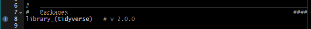

# {.unlisted .unnumbered}

##    Présentation du cours {.theme-section1 .unnumbered}

<!-- Chargement du package et des données utilisés dans les diapos -->
```{r}
#| label: initR
#| echo: false

rm(list = ls())

#   ____________________________________________________________________________
#   R version                                                               ####
#   R version 4.6.0 (2026-04-24 ucrt) -- "Because it was There"

#   ____________________________________________________________________________
#   Packages                                                                ####
library(tidyverse)    # v2.0.0
library(knitr)        # v1.51
library(kableExtra)   # v1.4.1 ; pour scroll_box
library(questionr)    # v0.8.2
library(Ecdat)        # v0.4.7

#   ____________________________________________________________________________
#   Données                                                                 ####
#   Données utilisées dans les exemples
data(Journals)
#   Données des exercices
readr::read_csv2(here::here("data"
                            , "communes.csv")
                 , na = c("NA", "", "N/A")) -> communes

#   ____________________________________________________________________________
#   Options des chunks                                                      ####
#   Fonction pour n'afficher que quelques lignes de l'output des chunks
##  Source : https://forum.posit.co/t/showing-only-the-first-few-lines-of-the-results-of-a-code-chunk/6963
hook_output <- knit_hooks$get("output")
knit_hooks$set(output = function(x, options) {
   lines <- options$output.lines
   if (is.null(lines)) {
     return(hook_output(x, options))  # pass to default hook
   }
   x <- unlist(strsplit(x, "\n"))
   more <- "..."
   if (length(lines) == 1) {        # first n lines
     if (length(x) > lines) {
       # truncate the output, but add ....
       x <- c(head(x, lines), more)
     }
   } else {
     x <- c(more, x[lines], more)
   }
   # paste these lines together
   x <- paste(c(x, ""), collapse = "\n")
   hook_output(x, options)
})
```

###    Objectifs pédagogiques {.unnumbered}

Dans ce cours, vous apprendrez à... 

-  utiliser [R]{.softw} sous [RStudio]{.softw} en utilisant les projets [RStudio]{.softw}
- travailler de manière **reproductible**, en organisant votre travail et en structurant vos scripts
- utiliser les principaux outils du `tidyverse` pour manipuler et visualiser des données
- produire des visualisations de données sous forme de graphiques de qualité, en utilisant [[{ggplot2}]{.pkg}](https://ggplot2.tidyverse.org/){target="_blank"}

###    Organisation des séances {.unnumbered}

1. Vendredi 02 octobre 2026 (3h)  
[R]{.softw} et [RStudio]{.softw}, bonnes pratiques pour une analyse reproductible : du projet au `tidyverse`

2. Lundi 05 octobre 2026 (2h30)  
Premiers graphiques [[{ggplot2}]{.pkg}](https://ggplot2.tidyverse.org/){target="_blank"}  
Transformation des données et approfondissements  [[{ggplot2}]{.pkg}](https://ggplot2.tidyverse.org/){target="_blank"}

3. Vendredi 09 octobre 2026 (4h30)  
Visualisations avancées et mini-projet

4. Vendredi 02 novembre (2h)  
Évaluation finale (1h30)  
Débriefing évaluation et cours

###    Évaluation finale {.unnumbered}

Format pratique sur ordinateur pour évaluer

- l'organisation du code
- la pertinence graphique
- la bonne utilisation du `tidyverse`
- la clarté/reproductibilité du script

##     `r fontawesome::fa("table")` Données utilisées dans les exemples {background-color="#9ed6e3" .unlisted .unnumbered}

Les exemples du cours s'appuient sur le jeu de données `Journals`, disponible dans le package [{Ecdat}]{.pkg}

Ce jeu de données se compose de 180 observations décrites par 10 variables

- **title** : titre de la revue
- **pub** : éditeur
- **society** : société
- **libprice** : prix de l'abonnement
- **pages** : nombre de pages
- **charpp** : nombre de caractères par page
- **citestot** : nombre total de citations
- **date1** : année de création de la revue
- **oclc** : nombre d'abonnements
- **field** : domaine de la revue

##     <span style="color:#FFFFFF;">`r fontawesome::fa("table")` Données utilisées dans les exercices {background-color="#222251" .unlisted .unnumbered .purplewhite-text}

Les exercices se feront sur le jeu de données fictives `communes`, disponible dans l'espace elearn

:::{.content-visible when-format="revealjs"}
**Dictionnaire des variables**
```{r}
#| label: communes
#| echo: false

variables <- c("CODGEO"
               , "commune"
               , "region"
               , "annee"
               , "population"
               , "revenu_median"
               , "taux_chomage"
               , "part_65plus"
               , "part_menages_1p"
               , "surface_urbaine"
               , "surface_verte"
               , "part_verte"
               , "emis_co2_hab"
               , "emis_co2_total"
               , "part_transport"
               , "part_residentiel")

descriptions <- c("Identifiant unique de la commune"
               , "Nom de la commune"
               , "Région"
               , "Année d'observation"
               , "Population totale"
               , "Revenu médian par ménage (€)"
               , "Taux de chômage (%)"
               , "Part des 65 ans et plus (%)"
               , "Part des ménages d'une personne (%)"
               , "Surface urbaine -- bâti, routes, zones d'activité -- (ha)"
               , "Surface d'espaces verts -- parcs, jardins, forêts, espaces naturels -- (ha)"
               , "Part d'espaces verts dans la surface totale (%)"
               , "Émissions de CO2 par habitant (tonnes eq. CO2/hab/an)emis_co2_hab"
               , "Émissions totales de CO2 (milliers de tonnes eq. CO2)"
               , "Part des émissions dues aux transports (%)"
               , "Part des émissions dues au résidentiel (%)")

types <- c("entier"
           , "caractère"
           , "caractère"
           , "entier (3 modalités)"
           , "numérique"
           , "numérique"
           , "numérique"
           , "numérique"
           , "numérique"
           , "numérique"
           , "numérique"
           , "numérique"
           , "numérique"
           , "numérique"
           , "numérique"
           , "numérique")

data.frame(Variable = variables
                 , Description = descriptions
                 , Type = types) -> df
df |> 
  kable() |>
  row_spec(0, color = "#6859A1") |> # en-tête du tableau en violet
  row_spec(1:nrow(df), color = "white") |> # couleur du texte en blanc dans toutes les lignes
  kable_paper(lightable_options = "striped"
              , full_width = T
              , html_font = "Avenir Next LT Pro"
              , font_size = 30) |>
  scroll_box(height = "805px")
```
:::

:::{.content-visible when-format="html" unless-format="revealjs"}
**Dictionnaire des variables**
```{r}
#| label: communeshtml
#| echo: false

variables <- c("CODGEO"
               , "commune"
               , "region"
               , "annee"
               , "population"
               , "revenu_median"
               , "taux_chomage"
               , "part_65plus"
               , "part_menages_1p"
               , "surface_urbaine"
               , "surface_verte"
               , "part_verte"
               , "emis_co2_hab"
               , "emis_co2_total"
               , "part_transport"
               , "part_residentiel")

descriptions <- c("Identifiant unique de la commune"
               , "Nom de la commune"
               , "Région"
               , "Année d'observation"
               , "Population totale"
               , "Revenu médian par ménage (€)"
               , "Taux de chômage (%)"
               , "Part des 65 ans et plus (%)"
               , "Part des ménages d'une personne (%)"
               , "Surface urbaine -- bâti, routes, zones d'activité -- (ha)"
               , "Surface d'espaces verts -- parcs, jardins, forêts, espaces naturels -- (ha)"
               , "Part d'espaces verts dans la surface totale (%)"
               , "Émissions de CO2 par habitant (tonnes eq. CO2/hab/an)emis_co2_hab"
               , "Émissions totales de CO2 (milliers de tonnes eq. CO2)"
               , "Part des émissions dues aux transports (%)"
               , "Part des émissions dues au résidentiel (%)")

types <- c("entier"
           , "caractère"
           , "caractère"
           , "entier (3 modalités)"
           , "numérique"
           , "numérique"
           , "numérique"
           , "numérique"
           , "numérique"
           , "numérique"
           , "numérique"
           , "numérique"
           , "numérique"
           , "numérique"
           , "numérique"
           , "numérique")

data.frame(Variable = variables
                 , Description = descriptions
                 , Type = types) -> df
df |> 
  kable() |>
  row_spec(0, color = "#6859A1") |> # en-tête du tableau en violet
  kable_paper(lightable_options = "striped"
              , full_width = T
              , html_font = "Avenir Next LT Pro"
              , font_size = 30)
```
:::

#      Séance 1. R et RStudio, bonnes pratiques pour une analyse reproductible : du projet au tidyverse {.theme-seance}

##     Objectifs pédagogiques

À l'issue de cette séance, vous serez capable de

- comprendre ce qu'est la reproductibilité
- de mettre en oeuvre de "bonnes" pratiques sous [R]{.softw}/[RStudio]{.softw} pour répondre aux enjeux de reproductibilité
- créer et organiser un projet [RStudio]{.softw}, en structurant vos scripts
- importer un jeu de données
- effectuer les premières manipulations et transformations sur les données avec le package [{dplyr}]{.pkg}


##     La reproductibilité {.theme-section1}

###    Pourquoi parler de reproductibilité ?

**Une analyse ne se résume pas à son résultat**, celui-ci doit pouvoir être

- compris
- vérifié
- réexécuté
- corrigé
- mis à jour
- partagé avec d'autres personnes

###    Qu'est-ce qu'une analyse reproductible ?

Une analyse est dite **reproductible ** lorsque l'on peut obtenir les mêmes résultats en utilisant

- les mêmes données en entrée
- les mêmes méthodes
- les mêmes étapes de calcul
- le même code

**La reproductibilité est un processus qui peut être reproduit par une autre personne et/ou à partir des mêmes données et qui permet d'expliquer et partager son travail**

<br />

:::{.callout-note title="Reproductibilité ? Réplicabilité ?"}
Deux notions à distinguer  
- **reproductibilité** : en utilisant le même code et les mêmes données , on retrouve le même résultat (valeur numérique, tableau, graphique, etc.)  
- **réplicabilité** : en appliquant la même démarche, sur de nouvelles données, on obtient des résultats comparables
:::

###    Que se passe-t'il sans "bonnes" pratiques ?

- Des résultats impossibles à retrouver
- Des chemins de fichiers propres à l'ordinateur de l'auteur
- Des modifications manuelles sur le fichier de données non documentées
- Des commandes exécutées dans la console qui ne figurent pas dans le script
- Des erreurs de copier-coller ou des résultats copiés manuellement dans un rapport
- Des versions différentes de [R]{.softw} ou des packages
- Des difficultés pour identifier les packages utilisés
- Des difficultés à transmettre ou à reprendre un travail plusieurs mois plus tard

`r fontawesome::fa("circle-exclamation", fill = "#A626A4")` **Ces problèmes sont souvent liés à l'organisation du travail**

<br />
`r fontawesome::fa("circle-chevron-right", fill = "#A626A4")` **Trois  grands principes à respecter pour éviter ces erreurs** [@Orozco2020]  

- Organiser son travail  
- Coder pour les autres  
- Automatiser le plus possible

###    De la donnée au résultat : une chaîne de travail transparente et documentée

:::::{.content-visible unless-format="pdf"}

::::{.columns}
:::{.column width="30%"}
{width="80%" fig-align="center" fig-alt="Chaîne de traitement."}
:::

:::{.column width="5%"}
<!-- colonne vide pour espacer les 2 colonnes de texte -->
:::

:::{.column width="65%"}
**À chaque étape, il faut pouvoir répondre à trois questions**

1. Qu'a-t'on fait ?
2. Pourquoi l'a-t'on fait ?
3. Peut-on refaire cette étape ?

`r fontawesome::fa("angles-right", fill = "#A626A4")` **Chaque opération doit être identifiable, justifiée et réexécutable**

<br />
**La reproductibilité repose sur la conservation** 

- des données
- du flux de traitement (scripts d'importation et de traitement, fonctions, méthodes statistiques utilisées)
- de la documentation (métadonnées, dictionnaire des variables, version de [R]{.softw} et des packages, instructions pour relancer l'analyse)
- des informations nécessaires à l'interprétation (tableaux, graphiques)
:::
::::
:::::

:::::{.content-visible when-format="pdf"}
{width="20%" fig-align="center" fig-alt="Chaîne de traitement."}

**À chaque étape, il faut pouvoir répondre à trois questions**

1. Qu'a-t'on fait ?
2. Pourquoi l'a-t'on fait ?
3. Peut-on refaire cette étape ?

`r fontawesome::fa("angles-right", fill = "#A626A4")` **Chaque opération doit être identifiable, justifiée et réexécutable**

**La reproductibilité repose sur la conservation** 

- des données
- du flux de traitement (scripts d'importation et de traitement, fonctions, méthodes statistiques utilisées)
- de la documentation (métadonnées, dictionnaire des variables, version de [R]{.softw} et des packages, instructions pour relancer l'analyse)
- des informations nécessaires à l'interprétation (tableaux, graphiques)
:::::

<!-- ###    Reproductibilité & principes FAIR -->

<!-- **Une analyse peut être reproductible sans que toutes les données soient publiques ** -->

<!-- L'ouverture des données est souhaitable mais elle n'est pas toujours possible (données confidentielles, soumises à une restriction d'accès, protégées par une licence), mais il est néanmoins possible de partager  -->

<!-- - le code -->
<!-- - la description des données -->
<!-- - les métadonnées -->
<!-- - les étapes de traitement -->
<!-- - un jeu de données anonymisé ou fictif -->
<!-- - les instructions d'accès aux données -->

<!-- pour répondre aux principes **FAIR** (_Findable_, _Accessible_, _Interoperable_, _Reusable_), qui visent à rendre les données faciles à trouver, accessibles, interopérables entre humains et machines, et réutilisables -->


<!-- :::{.callout-note appearance="simple"} -->
<!-- Ces principes s'appliquent surtout aux données de la recherche mais ils sont applicables à d'autres ressources numériques, comme les logiciels par exemple -->
<!-- ::: -->

##     Comment travailler de façon reproductible avec R/RStudio ?  {.theme-section1}

###    Les projets [RStudio]{.softw}

Les projets [RStudio]{.softw} sont utiles pour 

- **organiser plus facilement son travail** : 1 projet = 1 étude  
`r fontawesome::fa("angles-right", fill = "#A626A4")` environnement isolé, pas de conflits entre projets
- **regrouper dans un même dossier tous les scripts** : scripts **R**/quarto, fonctions, données, résultats, graphiques, etc. 
- **améliorer la portabilité et faciliter les collaborations** : utilisation des chemins de fichiers relatifs  
`r fontawesome::fa("angles-right", fill = "#A626A4")` reproductibilité facilitée

:::{.callout-note title="Chemins absolus/relatifs"}
- Le chemin absolu est exprimé par rapport au disque dur, à l'ordinateur  
*Exemple* : `C:/Users/...`

- Le chemin relatif est exprimé par rapport au projet  
*Exemple* : `data/mon_fichier.csv`

`r fontawesome::fa("lightbulb", fill = "#A626A4")` **Le répertoire par défaut du projet est le dossier où est enregistré le projet sur votre machine** 
:::

--- 

####   Comment créer un projet ?

:::::{.content-visible unless-format="pdf"}

::::{.columns}
:::{.column width="47%"}
- À partir de l'icône dédiée en haut à droite de [RStudio]{.softw}
:::

:::{.column width="6%"}
<!-- colonne vide pour espacer les 2 colonnes de texte -->
:::

:::{.column width="47%"}
{width="50%" fig-align="center" fig-alt="Icone nouveau projet RStudio."}

:::
::::

::::{.columns}
:::{.column width="47%"}
- Cliquez sur `New Project > New Directory > New Project` et complétez les informations requises 

  + le nom du dossier/projet 
  + son emplacement (dossier de votre choix)
:::

:::{.column width="6%"}
<!-- colonne vide pour espacer les 2 colonnes de texte -->
:::

:::{.column width="47%"}
{width=100%" fig-align="center" fig-alt="Menu : créer un nouveau projet."}
:::
::::
:::::

:::::{.content-visible when-format="pdf"}
À partir de l'icône dédiée en haut à droite de [RStudio]{.softw}

{width="30%" fig-align="center" fig-alt="Icone nouveau projet RStudio."}

Cliquez sur `New Project > New Directory > New Project` et complétez les informations requises 

- le nom du dossier/projet 
- son emplacement (dossier de votre choix)

{width="55%" fig-align="center" fig-alt="Créer un nouveau projet."}
:::::

:::{.callout-tip appearance="simple"}
**Quand le projet est créé**

- [RStudio]{.softw} redémarre et se place dans ce projet
- le projet apparaît dans l'onglet *Files* de [RStudio]{.softw}

`r fontawesome::fa("lightbulb", fill = "#A626A4")` **Pour ranger efficacement les différents documents liés à l'analyse, vous pouvez créer les sous-dossiers**  
- soit en cliquant sur `New Folder` dans le menu en haut de l'onglet *Files*  
- soit de façon classique, à partir de l'explorateur de fichier de votre machine
:::

--- 

####   Comment structurer ses projets ?

**Choisissez la structuration qui vous correspond le mieux** et qui permet

- de **rassembler** tous les éléments liés au projet dans un seul dossier
- de **structurer** en dossiers/sous-dossiers pour séparer données source/créées, scripts, documentation, résultats, etc.

:::{.callout-tip appearance="simple"}
**Les données initiales et les scripts de traitement sont les plus importants**
:::

:::::{.content-visible unless-format="pdf"}
::::{.columns}
:::{.column width="30%"}
{width="70%" fig-align="center" fig-alt="Structure de projet RStudio."}
:::

:::{.column width="3%"}
<!-- colonne pour espacer les 2 colonnes de texte -->
:::

:::{.column width="30%"}
{width="90%" fig-align="center" fig-alt="Exemple de structure minimale."}
:::

:::{.column width="3%"}
<!-- colonne vide pour espacer les 2 colonnes de texte -->
:::

:::{.column width="30%"}
{width="85%" fig-align="left" fig-alt="Exemple de structure optimale."}
:::
<center><small>Exemples de structuration de projets [R]{.softw} <br /> *Source des figures 2 & 3 : <https://learn.r-journalism.com/en/publishing/workflow/r-projects/>{target="_blank"} - Dernier accès : 2026-09-08*</small></center>
::::
:::::

:::{.content-visible when-format="pdf"}
{width="33%" fig-alt="Structure de projet RStudio."}
{width="33%" fig-alt="Exemple de structure minimale."}
{width="33%" fig-alt="Exemple de structure optimale."}

<center><small>Exemples de structuration de projets [R]{.softw} <br /> *Source (figures 2 & 3) : <https://learn.r-journalism.com/en/publishing/workflow/r-projects/>{target="_blank"} - Dernier accès : 2026-09-08*</small></center>
:::

###    Les scripts [R]{.softw}

- Ils permettent de **garder la trace** du processus de création de chaque variable, tableau, figure, etc., ce qui permet de refaire les traitements dans leur globalité  
- Ils sont **facilement partageables** avec d'autres, sous réserve de respecter des pratiques de "bon" usage  
  + coder de façon compréhensible avec des commentaires et en documentant ses fonctions  
  + donner des noms explicites aux objets et fonctions
  + utiliser les conventions de nommage, notamment pour distinguer les variables d'origine des variables créées

:::{.callout-tip appearance="simple"}
- Pour les **variables**, utiliser un **nom**  
*Exemple* : `temperature_max`
- Pour les **fonctions**, utiliser un **verbe**  
*Exemple* : `create.map` serait une fonction qui permettrait de créer une carte
- Pour **distinguer variables d'origine / variables recodées**, on peut utiliser un préfixe ou un suffixe  
*Exemple* : `age` est la variable d'origine et `age_recod` est la variable recodée
:::

---

:::{.callout-note title="Les conventions de nommage"}
Il existe différentes conventions

- **`allowercase`** : tout en minuscule, sans séparateur
- **`period.separated`** : tout en minuscule, mots séparés par des points
- **`underscore_separated`** : tout en minuscule, mots séparés par un *underscore* (`_`)
- **`lowerCamelCase`** : première lettre des mots en majuscule, à l'exception du premier mot ; et si nom simple, tout en minuscule
- **`UpperCamelCase`** : première lettre des mots en majuscule, y compris le premier et même lorsque le nom est composé d'un seul mot

`r fontawesome::fa("lightbulb", fill = "#A626A4")` **Possibilité de mixer les conventions mais en gardant une cohérence afin de faciliter la compréhension des fichiers et du code**
:::

<br/>

:::{.callout-warning appearance="simple"}
**[R]{.softw} est sensible à la casse** ce qui signifie que `variable` et `Variable` sont deux objets différents
:::

---

####   Comment organiser ses scripts ?

- Utiliser une **convention de dénomination des fichiers** et donner des **noms explicites**
- **Séparer les traitements**  
  + import et préparation des données (nettoyage, fusion, filtrage)  
  + traitement statistique
    * analyses univariées
    * analyses bivariées
    * analyses multivariées/modélisation
  + production des résultats, rapports 

:::{.callout-tip title="Comment nommer ses scripts ?"}
- Une "bonne" pratique consiste à utiliser la structure `numero_nom_millesime.extension`  
- Le nom ne doit contenir ni caractères spéciaux (``-.,;:\/$^`) ni caractères accentués  
*Exemple* : `01_import_donnees_20250606.R` ; `02_nettoyage_donnees_20250610.R` ; `03_analyses_univariees_20250701.R`
:::

:::{.callout-note title="Ressources sur le processus d'analyse et de communication des données reproductibles"}
`r fontawesome::fa("globe", fill = "#A626A4")` [R Workflow](https://hbiostat.org/rflow){target="_blank"}

`r fontawesome::fa("globe", fill = "#A626A4")` [Reproducible analytical pipeline](https://raps-with-r.dev/)
:::

---

####   Comment structurer ses scripts ? 

::::{.columns}
:::{.column width="47%"}
1.   Commencer l'écriture du script par les **métadonnées** (titre, auteur, date, version de [R]{.softw}, encodage, etc.)
:::

:::{.column width="6%"}
<!-- colonne vide pour espacer les 2 colonnes de texte -->
:::

:::{.column width="47%"}
{width="95%" fig-align="center" fig-alt="En-tête de script."}
:::
::::

2.   Lister les **packages** utilisés, au début des scripts, pour les identifier plus rapidement, en notant leur version

::::{.columns}
:::{.column width="47%"}
- manuellement
```r
library(tidyverse)    # v2.0.0
library(questionr)    # v0.8.2
```
:::

:::{.column width="6%"}
<!-- colonne vide pour espacer les 2 colonnes de texte -->
:::

:::{.column width="47%"}
- de façon automatisée
```r
packages_utilises <- sessionInfo()
```
:::
::::

3.   **Structurer** en parties et sous-parties, facilement grâce à l'*addin* `strcode`  

::::{.columns}
:::{.column width="47%"}
```r
#   ____________________________________________
#   Titre 1                                 ####
##  ............................................
##  Titre 2                                 ####
```
:::

:::{.column width="6%"}
<!-- colonne vide pour espacer les 2 colonnes de texte -->
:::

:::{.column width="47%"}
`r fontawesome::fa("gears", fill = "#A626A4")` *Installation : `remotes::install_github("lorenzwalthert/strcode")`*  
:::
::::

4. **Commenter** les scripts, en particulier pour expliquer les étapes-clés (= une aide pour les autres, mais aussi pour soi, pour plus tard)

---

:::{.callout-note title="Le préfixage"}
La notation
```r
dplyr::filter(Journals, field == "Econometrics")
```
peut remplacer le code
```r
library(dplyr)
filter(Journals, field == "Econometrics")
```

**Avantages**

- Évite les conflits si plusieurs packages ont une fonction avec le même nom (mais des paramètres différents)  
*Exemple*  la fonction `filter()` existe dans les packages [{stats}]{.pkg} et [{dplyr}]{.pkg}
- Identifie le package d'où provient une fonction
- Ne charge pas la totalité d'un package pour n'utiliser qu'une seule de ses fonctions
:::

---

:::{.callout-tip title="Aide pour écrire les scripts"}
`r fontawesome::fa("gears", fill = "#A626A4")` Activer les options de diagnostic pour signaler les erreurs dans les scripts sous [RStudio]{.softw} : `Tools > Global Options > Code > Diagnostics`

{width="100%" fig-align="center" fig-alt="Diagnostic de script."}

`r fontawesome::fa("r-project", fill = "#A626A4")` package [[{styler}](https://github.com/r-lib/styler){target="_blank"}]{.pkg} : mettre en forme le code selon le [Tidyverse Style Guide](https://style.tidyverse.org/index.html){target="_blank"} (ou selon son propre style)  

`r fontawesome::fa("r-project", fill = "#A626A4")` package [[{lintr}](https://lintr.r-lib.org/){target="_blank"}]{.pkg} : vérifier que le code est conforme à un guide de style donné
:::

---

###    Le fichier README

Ce fichier, généralement un fichier au format .txt ou .md (markdown), qui présente le **projet**, sa **structuration** et les **étapes d'exécution des différents script** pour comprendre, reproduire et utiliser le projet, est à placer dans le dossier du projet

**Exemple de fichier README**

```md
# VisuR_2026

Projet du cours "Visualisation des données sous R" pour l'année universitaire 2026-2027

## Structure
- data/ : données 
    ├── sources/ : données sources, données brutes
    └── produites/ : données produites
- scripts/ : scripts R, qmd
- outputs/ : graphiques et tableaux exportés
- docs/ : rapports et supports

## Comment reproduire les analyses
1. Ouvrir le projet `VisuR_2026.Rproj`
2. Exécuter les scripts dans l'ordre (01_import.R, 02_nettoyage.R, etc.)
3. Les graphiques générés sont enregistrés dans le dossier outputs
4. Le rapport d'étude est enregistré dans le dossier docs
```

---

###    Citer la version de [R]{.softw} ainsi que les packages que vous avez utilisés dans vos travaux

**Avec la fonction `citation()`**

<br />

::::{.columns}
:::{.column width="45%"}
####   Pour citer la version de [R]{.softw}

```{r}
#| label: citeR

# Citer R
citation()
```
:::

:::{.column width="5%"}
<!-- colonne vide pour espacer les 2 colonnes de texte -->
:::

:::{.column width="50%"}
####   Pour citer un package

```{r}
#| label: citePkg

# Citer un package (ici ggplot2)
citation("ggplot2")
```
:::
::::

<!-- EXERCICE 1. -->
##     `r fontawesome::fa("keyboard")` À VOUS DE JOUER ! {background-color="#222251" .purplewhite-text}
:::{#exr-seance1_1}
01. Vérifier que [R] et [RStudio] sont installés
02. Définir l'encodage UTF-8 
03. Vérifier que le package `{tidyverse}` est installé et l'installer si ce n'est pas le cas

**`r fontawesome::fa("circle-question", fill = "#FFFFFF")` Quelle est la version de [R] et des packages `{tidyverse}` et `{ggplot2}` que vous utilisez ?**

04. Sous [RStudio], créer un projet nommé **`VisuR_exercices`**
05. Créer les dossiers nécessaires pour une bonne structuration de votre travail
06. Déposer le fichier `communes.csv` dans le dossier adéquat de votre projet
07. Dans votre projet [RStudio], créer un script [R] nommé **`Exercices_VisuR.R`**, qui servira pour les exercices à venir, durant lesquels vous aurez besoin des packages `{readr}`, `{dplyr}` et `{ggplot2}` 
08. Commencer l'écriture de ce script avec ces premiers éléments
:::

##     L'univers du `tidyverse` {.theme-section1}

###    Présentation générale et installation

- **Ensemble de packages reprenant des opérations courantes de [R]{.softw}, qui partagent une même philosophie et syntaxe pour travailler ensemble et faciliter, la manuipulation, l'analyse et la visualisation des données**  
- L'accent est mis sur la lisibilité et la chaîne d'opérations, via l'opérateur *pipe* `|>`  
`r fontawesome::fa("angles-right", fill = "#A626A4")` code dans l'ordre logique des étapes, moins d'objets intermédiaires et de parenthèses imbriquées que dans la syntaxe [R]{.softw} de base  

`r fontawesome::fa("gears", fill = "#A626A4")` La commande `install.packages("tidyverse")` installe simultanément plusieurs packages

::::{.columns}
:::{.column width="47%"}
  + [[{dplyr}]{.pkg}](https://dplyr.tidyverse.org/){target="_blank"} : manipulation des données
  + [[{forcats}]{.pkg}](https://forcats.tidyverse.org/){target="_blank"} : traitement des variables qualitatives
  + [[{ggplot2}]{.pkg}](https://ggplot2.tidyverse.org/){target="_blank"} : visualisation des données
  + [[{lubridate}]{.pkg}](https://lubridate.tidyverse.org/){target="_blank"} : manipulation des dates et heures
  + [[{purrr}]{.pkg}](https://purrr.tidyverse.org/){target="_blank"} : programmation
:::

:::{.column width="6%"}
<!-- colonne vide pour espacer les 2 colonnes de texte -->
:::

:::{.column width="47%"}
  + [[{readr}]{.pkg}](https://readr.tidyverse.org/){target="_blank"} : import de données
  + [[{stringr}]{.pkg}](https://stringr.tidyverse.org/){target="_blank"} : manipulation des chaînes de caractères
  + [[{tibble}]{.pkg}](https://tibble.tidyverse.org/){target="_blank"} : version modernisée des *dataframes*, plus pratiques à utiliser que les *dataframes* "classiques"
  + [[{tidyr}]{.pkg}](https://tidyr.tidyverse.org/){target="_blank"} : nettoyage, remise en forme des données
:::
::::
`r fontawesome::fa("lightbulb", fill = "#A626A4")` La commande `library("tidyverse")` charge simultanément ces neuf packages au coeur du tidyverse

---

{width="90%" fig-align="center" fig-alt="Datascience et tidyverse."}

---

####   L'opérateur *pipe*

- Opérateur qui permet d'enchaîner des opérations : il prend la sortie d'une fonction (ou d'une expression) et la passe automatiquement comme **premier** argument à la fonction suivante
- Initialement fourni dans le package [{magrittr}](https://magrittr.tidyverse.org/){target="_blank"} et noté `%>%`
- Implémenté dans le langage **R** de base depuis la version 4.1.0 et noté `|>`

```r
data |>
  fonction1() |>
  fonction2() |>
  fonction3()
# équivaut à
fonction3(fonction2(fonction1(data)))
```

<br />

:::{.callout-tip appearance="simple"}
**Il est recommandé d'utiliser le pipe natif de R** `|>`

<br />
`r fontawesome::fa("gears", fill = "#A626A4")` **Comment utiliser le pipe natif sous RStudio ?**  
- Allez dans `Tools > Global Options > Code > Editing`  
- Cochez `Use native pipe operator, |> (requires R 4.1+)`
:::

---

####   Les *tibbles*

- **Version modernisée des _dataframes_**, proposée dans le cadre du [`tidyverse`](https://www.tidyverse.org/){target="_blank"}
- Plus pratiques à utiliser que les *dataframes* "classiques"
- Plus rapides à manipuler (et plus stables) que les *dataframes*
- Il est possible de convertir d'un type à l'autre
  + *dataframe* $\rightarrow$ *tibble* : avec la fonction `as_tibble()` du package [{tibble}](https://tibble.tidyverse.org/){target="_blank"}
  + *tibble* $\rightarrow$ *dataframe* : avec la fonction **R** de base `as.data.frame()`

`r fontawesome::fa("r-project", fill = "#A626A4")` Pour connaître le type d'objet et savoir si on a u n_dataframe_ ou un _tibble_, on peut utiliser la fonction `str()`

---

::::{.content-visible unless-format="pdf"}
:::{.callout-note title="Aperçu des formats"}
#####  dataframe {.unlisted .unnumbered}
```{r}
#| label: dataframe 
#| width: 150

Journals |> 
  head(2)
```

<br />

#####  tibble {.unlisted .unnumbered}
```{r}
#| label: tibble

Journals |> 
  as_tibble() |> 
  head(2)
```
:::
::::

::::{.content-visible when-format="pdf"}
####   Aperçu des formats {.unlisted .unnumbered}
**_dataframe_**
```{r}
#| label: dataframepdf

Journals |> 
  head(2)
```

**_tibble_**
```{r}
#| label: tibblepdf

Journals |> 
  as_tibble() |> 
  head(2)
```
::::

##     Manipulations des données {.theme-section1}

###    Import/Export des données

- Depuis/vers des formats "plats" ou délimités (.csv, .txt)
- Depuis/vers des fichiers Excel ou issus d'autres logiciels de statistique (Stata, SPSS, etc.)
- Depuis/vers des bases de données relationnelles

<br />

:::{.callout-tip title="Pour l'import, bien étudier le jeu de données source, à l'aide des questions suivantes"}
1. La première ligne contient-elle le nom des variables ?  
2. Quel est le séparateur des colonnes : `,`, `;`, espace(s), `\t` ?  
3. Quel est le caractère utilisé pour indiquer les décimales : le point (à l'anglo-saxonne) ou la virgule (à la française) ?  
4. Les valeurs textuelles sont-elles encadrées par des guillemets ? Si oui, s'agit-il de guillemets simples (`'`) ou de guillemets doubles (`"`) ?  
5. Y a-t-il des valeurs manquantes ? Si oui, comment sont-elles indiquées ?  
:::

---

####   Les fonctions d'import

| Type de fichier | Séparateur de colonnes | Séparateur décimal | Tidyverse              | Base R                 |
|:----------------|:-----------------------|:-------------------|:-----------------------|:-----------------------|
| Délimité        | `,`                    | `.`                | `readr::read_csv()`    | `read.csv()`           |
|                 | `;`                    | `,`                | `readr::read_csv2()`   | `read.csv2()`          |
|                 | un espace (ou plus)    | `.`                | `readr::read_table()`  | `read.table()`         |
|                 | `\t`                   | `.`                | `readr::read_delim()`  | `read.delim()`         |
|                 | `\t`                   | `,`                | `readr::read_delim2()` | `read.delim2()`        |
| Excel           |                        |                    | `readxl::read_excel()` | `xlsx::read.xlsx()`    |
| SPSS            |                        |                    | `haven::read_spss()`   | `foreign::read.spss()` |
|                 |                        |                    | `haven::read_sav()`    |                        |
| Stata           |                        |                    | `haven::read_stata()`  | `foreign::read.dta()`  |
| SAS             |                        |                    | `haven::read_sas()`    | `foreign::read.ssd()`  |
| dBase           |                        |                    |                        | `foreign::read.dbf()`  |

: {tbl-colwidths="[10, 20, 20, 25, 25]"}

---

####   Les fonctions d'export

| Type de fichier | Tidyverse                          | Base R                                     |
|:----------------|:-----------------------------------|:-------------------------------------------|
| .txt            | `readr::write_delim(delim = "\t")` | `write.table()`                            |
| .csv            | `readr::write_csv()`               | `write.csv()`                              |
| .xlsx           | `openxlsx2::write_xlsx()`          |                                            |
|                 | `writexl::write_xlsx()`            |                                            |
| .dbf            |                                    | `foreign::write.dbf()`                     |
| .sav (SPSS)     | `haven::write_sav()`               | `foreign::write.foreign(package = "SPSS")` |
| .dta (Stata)    | `haven::write_dta()`               | `foreign::write.dta()`                     |

---

####   Exemple d'import pour un fichier .csv

```r
readr::read_csv("file.csv"
                # si la première ligne contient le nom des variables :
                , col_names = TRUE)
```

<br />

:::{.callout-tip title="Zoom sur la fonction `read_csv2()`"}
La fonction `readr::read_csv2()` considère par défaut que le séparateur de colonnes est le point-virgule et que la virgule sert de séparateur décimal

La fonction en langage [R]{.softw} de base `read.csv2()` a les mêmes paramètres par défaut

`r fontawesome::fa("lightbulb", fill = "#A626A4")` **Utiliser ces fonctions lorsque les fichiers .csv ont ces caractéristiques**
:::

###    Manipulations sur les observations et les variables avec le package [[{dplyr}]{.softw}](https://dplyr.tidyverse.org/){target="_blank"}

**Principales fonctions utiles pour**  

- **les lignes/observations**  
  + `filter()` : sélectionner/filtrer des observations
  + `distinct`: afficher les observations distinctes
- **les colonnes/variables**  
  + `select()` : sélectionner/extraire des variables
  + `mutate()` : créer des variables
  + `relocate()` : changer l'ordre d'une colonne
  + `rename()` : changer le nom des variables

::: {.callout-note title="Aide-mémoire des principales fonctions du package [{dplyr}]{.pkg}"}
`r fontawesome::fa("r-project", fill = "#A626A4")` [*Cheatsheet*](https://rstudio.github.io/cheatsheets/data-transformation.pdf){target="_blank"}
:::

---

####   Filtrer des observations avec la fonction `filter()`

::::{.columns}
:::{.column width="47%"}
#####  Selon un seul critère  

```{r}
#| label: filtersimple

# Revues dans le domaine de la Démographie
Journals |> 
  dplyr::filter(field == "Demography")
```
:::

:::{.column width="6%"}
<!-- colonne vide pour espacer les 2 colonnes de texte -->
:::

:::{.column width="47%"}
#####  Selon plusieurs critères

En utilisant les opérateurs logiques

```{r}
#| label: filterAND

# Revues de Démographie dont l'abonnement coûte moins de 100$
Journals |> 
  dplyr::filter(field == "Demography" & libprice < 100)
```
:::
::::

---

::: {.callout-note title="Opérateurs logiques les plus courants"}

| **Opérateur** | **Description**                 |
|:--------------|:--------------------------------|
| `<`           | Inférieur à                     |
| `<=`          | Inférieur ou égal à             |
| `>`           | Supérieur à                     |
| `>=`          | Supérieur ou égal à             |
| `==`          | Exactement égal à               |
| `!=`          | Différent de                    |
| `|`           | Ou                              |
| `&`           | Et                              |
| `%in%`        | Appartient à                    |
| `is.na()`     | Est une donnée manquante        |
| `!is.na()`    | N'est pas une donnée manquante  |

:::

---

####   Afficher les valeurs distinctes avec la fonction `distinct()`

On peut afficher les valeurs distinctes selon une (ou plusieurs) variables

```{r}
#| label: distinct

# Afficher les valeurs distinctes de 'field'

Journals |> 
  distinct(field)
```

`r fontawesome::fa("lightbulb", fill = "#A626A4")` **Cette fonction peut aussi servir à supprimer les doublons dans un jeu de données**

---

####   Sélectionner des colonnes avec la fonction `select()`

#####  Une seule colonne

```{r, output.lines=10}
#| label: select

# Sélection de la variable "pub"
Journals |>
  dplyr::select(pub)
```

---

#####  Plusieurs colonnes

::::{.columns}
:::{.column width="47%"}
###### En listant la/les variables à conserver</span>

```{r, output.lines=3}
#| label: selectMultiple

# Sélection des variables "field" et "libprice"
Journals |>
  dplyr::select(c(field, libprice))
```
:::

:::{.column width="6%"}
<!-- colonne vide pour espacer les 2 colonnes de texte -->
:::

:::{.column width="47%"}
###### En listant la/les variables à supprimer

```{r, output.lines=3}
#| label: selectNot

# Sélection des variables sauf "title" et "pub"
Journals |>
  dplyr::select(-c(title, pub))
```

:::
::::

::::: {.callout-tip appearance="simple"}

::::{.columns}
:::{.column width="47%"}
Les tests sur le nom des variables peuvent se faire avec différentes fonctions :

- `contains()` 
- `starts_with()`
- `ends_with()` 
- `matches()`
:::

:::{.column width="6%"}
<!-- colonne vide pour espacer les 2 colonnes de texte -->
:::

:::{.column width="47%"}

<br />

```{r, output.lines=2}
#| label: contains

# Sélection des variables dont le nom contient "s"
Journals |>
  dplyr::select(contains("s"))
```
:::
::::

:::::

---

####   Créer/ajouter de nouvelles variables avec `mutate()`

::::{.columns}
:::{.column width="47%"}

<br />

```{r, output.lines=4}
#| label: mutate

# Ajout de la variable "anciennete"
Journals |>
  mutate(anciennete = 2026 - date1) -> Journals

names(Journals)
```

<br />
`r fontawesome::fa("triangle-exclamation", fill = "#A626A4")` **Penser à affecter la modification au jeu de données**
:::

:::{.column width="6%"}
<!-- colonne vide pour espacer les 2 colonnes de texte -->
:::

:::{.column width="47%"}
- La fonction `mutate()` peut également 

  + modifier une variable existante si le nom est le même que celui d'une colonne existante
  + supprimer une variable en fixant sa valeur à `NULL`

```{r, output.lines=4}
#| label: mutateNULL

# Suppression de la variable "charpp"
Journals |>
  mutate(charpp = NULL) |>
  names()
```
:::
::::

---

#####  Appliquer des règles conditionnelles

###### La fonction `if_else()`

```r
Journals |> 
  mutate(cl_anciennete = if_else(anciennete < 30, " Moins de 30 ans",
                                 if_else(anciennete >= 30  & anciennete < 50, "30 à 49 ans",
                                         if_else(anciennete >= 50 & anciennete < 100, "50 à 99 ans",
                                                 if_else(anciennete >= 100 & anciennete < 150, 
                                                         "100 à 149 ans", "150 ans et plus"))))) -> Journals
```

<br />

###### La fonction `case_when()`

```r
Journals |> 
  mutate(cl_annciennete = case_when(anciennete < 30 ~ "Moins de 30 ans",
                                    anciennete >= 30  & anciennete < 50 ~ "30 à 49 ans",
                                    anciennete >= 50 & anciennete < 100 ~ "50 à 99 ans",
                                    anciennete >= 100 & age < 150 ~ "100 à 149 ans", 
                                    anciennete >= 150 ~ "150 ans et plus",
                                    TRUE ~ "ERREUR")) -> Journals
```

---

####   Réordonner les variables avec la fonction `relocate()`

`r fontawesome::fa("lightbulb", fill = "#A626A4")` Les nouvelles variables ajoutées avec `mutate()` se positionnent toujours à la fin du jeu de données  

`r fontawesome::fa("angles-right", fill = "#A626A4")` Il est possible de les positionner où l'on souhaite, avec la fonction `relocate()`

```{r}
#| label: relocateafter

# On repositionne la variable 'anciennete' après la variable 'date1' 
Journals |> 
  relocate(anciennete, .after = date1) -> Journals

# Vérification
Journals |> 
  names()
```

<br />
On aurait également pu obtenir le même résultat avec le paramètre `.before`

```r
Journals |> 
  relocate(anciennete, .before = oclc) -> Journals
```

---

####   Modification du nom des colonnes avec `rename()`

```{r}
#| label: rename

# On renomme la colonne 'pub' en 'publisher'
Journals |>
  dplyr::rename(publisher = pub) -> Journals

# Vérification : affichage du nom des colonnes
Journals |> 
  names()
```

<br />
`r fontawesome::fa("triangle-exclamation", fill = "#A626A4")` **Ne pas oublier d'affecter la modification au jeu de données**

<!-- EXERCICE 2. -->
##     `r fontawesome::fa("keyboard")` À VOUS DE JOUER ! {background-color="#222251" .purplewhite-text}
:::{#exr-seance1_2}
On se place toujours dans le projet **`VisuR_exercices`** et on utilise les fonctions du `tidyverse`

01. Importer les données du fichier `communes.csv` dans un objet `communes`
02. Quel est le type de cet objet et sa structure (nombre de lignes et de colonnes) ?
03. La variable `CODGEO` est un code. Transformer en variable caractère avec la fonction `as.character()` 
04. Combien de communes distinctes y a-t'il dans `communes` ? et combien d'années ? 
05. Filtrer les données pour n'afficher que les observations de l'année 2018
06. Créer la variable `surface = surface_urbaine + surface_verte` dans votre jeu de données. elle doit se trouver avant la variable `surface_urbaine`
07. Afficher la colonne commune et toutes celles qui commencent par "surface_"
:::

#      Bibliographie {.theme-seance}

<!-- Création de la base biblio des packages cités/utilisés dans le cours -->
```{r}
#| label: biblio
#| eval: false
#| include: false
#| echo: false
knitr::write_bib(c(# séance 1
                   "Ecdat", "readr", "tidyverse", "questionr", "strcode"
                   , "remotes", "styler", "lintr", "dplyr", "ggplot2"
                   , "forcats", "lubridate", "purrr", "stringr", "tibble"
                   , "tidyr", "magrittr", "readxl", "haven", "openxlsx2"
                   , "writexl", "xlsx", "foreign"
                   # séance 2
                   # séances 3 & 4
                   )
                 , "packagesR_2026.bib")
```


###    Références citées {.unlisted .unnumbered .smaller}
<!-- https://github.com/pandoc-ext/multibib -->
::: {#refs-main}
<!-- Réfs citées dans le texte insérées dans cette section -->
:::


:::: {.content-visible when-format="revealjs"}
###    Packages {.unlisted .unnumbered .smaller .scroll-container style="overflow-y: scroll;"}
::: {#refs-packages}
<!-- Réfs du fichier packagesR_2026.bib insérées dans cette section, sans être citées dans le texte -->

---
nocite: |
  @ggplot22016, @lintr2025, @lubridate2011, @R-dplyr, @R-Ecdat, @R-forcats, @R-foreign, @R-ggplot2, @R-haven, @R-lintr, @R-lubridate, @R-magrittr, @R-openxlsx2, @R-purrr, @R-questionr, @R-readr, @R-readxl, @R-remotes, @R-strcode, @R-stringr, @R-styler, @R-tibble, @R-tidyr, @R-tidyverse, @R-writexl, @R-xlsx, @tidyverse2019
---

:::
::::

:::: {.content-visible unless-format="revealjs"}
###    Packages {.unlisted .unnumbered}
::: {#refs-packages}
<!-- Réfs du fichier packagesR_2026.bib insérées dans cette section, sans être citées dans le texte -->

---
nocite: |
  @ggplot22016, @lintr2025, @lubridate2011, @R-dplyr, @R-Ecdat, @R-forcats, @R-foreign, @R-ggplot2, @R-haven, @R-lintr, @R-lubridate, @R-magrittr, @R-openxlsx2, @R-purrr, @R-questionr, @R-readr, @R-readxl, @R-remotes, @R-strcode, @R-stringr, @R-styler, @R-tibble, @R-tidyr, @R-tidyverse, @R-writexl, @R-xlsx, @tidyverse2019
  
---

:::
::::

<!-- Pour compiler le document, dans le terminal lancer la commande : -->
<!-- quarto render index.qmd --to revealjs -->
