# {.unlisted .unnumbered}

##    Présentation du cours {.theme-section1 .unnumbered}

<!-- Chargement du package et des données utilisés dans les diapos -->
```{r}
#| label: initR
#| echo: false

rm(list = ls())

#   ____________________________________________________________________________
#   R version                                                               ####
#   R version 4.6.0 (2026-04-24 ucrt) -- "Because it was There"

#   ____________________________________________________________________________
#   Packages                                                                ####
library(tidyverse)    # v2.0.0
library(knitr)        # v1.51
library(kableExtra)   # v1.4.1 ; pour scroll_box
library(questionr)    # v0.8.2
library(Ecdat)        # v0.4.7

#   ____________________________________________________________________________
#   Données                                                                 ####
#   Données utilisées dans les exemples
data(Journals)
#   Données des exercices
readr::read_csv2(here::here("data"
                            , "communes.csv")
                 , na = c("NA", "", "N/A")) -> communes

#   ____________________________________________________________________________
#   Options des chunks                                                      ####
#   Fonction pour n'afficher que quelques lignes de l'output des chunks
##  Source : https://forum.posit.co/t/showing-only-the-first-few-lines-of-the-results-of-a-code-chunk/6963
hook_output <- knit_hooks$get("output")
knit_hooks$set(output = function(x, options) {
   lines <- options$output.lines
   if (is.null(lines)) {
     return(hook_output(x, options))  # pass to default hook
   }
   x <- unlist(strsplit(x, "\n"))
   more <- "..."
   if (length(lines) == 1) {        # first n lines
     if (length(x) > lines) {
       # truncate the output, but add ....
       x <- c(head(x, lines), more)
     }
   } else {
     x <- c(more, x[lines], more)
   }
   # paste these lines together
   x <- paste(c(x, ""), collapse = "\n")
   hook_output(x, options)
})
```

###    Objectifs pédagogiques {.unnumbered}

Dans ce cours, vous apprendrez à... 

-  utiliser [R]{.softw} sous [RStudio]{.softw} en utilisant les projets [RStudio]{.softw}
- travailler de manière **reproductible**, en organisant votre travail et en structurant vos scripts
- utiliser les principaux outils du `tidyverse` pour manipuler et visualiser des données
- produire des visualisations de données sous forme de graphiques de qualité, en utilisant [[{ggplot2}]{.pkg}](https://ggplot2.tidyverse.org/){target="_blank"}

###    Organisation des séances {.unnumbered}

1. Vendredi 02 octobre 2026 (3h)  
[R]{.softw} et [RStudio]{.softw}, bonnes pratiques pour une analyse reproductible : du projet au `tidyverse`

2. Lundi 05 octobre 2026 (2h30)  
Premiers graphiques [[{ggplot2}]{.pkg}](https://ggplot2.tidyverse.org/){target="_blank"}  
Transformation des données et approfondissements  [[{ggplot2}]{.pkg}](https://ggplot2.tidyverse.org/){target="_blank"}

3. Vendredi 09 octobre 2026 (4h30)  
Visualisations avancées

4. Vendredi 02 novembre (2h)  
Évaluation finale (1h30)  
Débriefing évaluation et cours

###    Évaluation finale {.unnumbered}

Format pratique sur ordinateur pour évaluer

- l'organisation du code
- la pertinence graphique
- la bonne utilisation du `tidyverse`
- la clarté/reproductibilité du script

##     `r fontawesome::fa("table")` Données utilisées dans les exemples {background-color="#9ed6e3" .unlisted .unnumbered}

Les exemples du cours s'appuient sur le jeu de données `Journals`, disponible dans le package [{Ecdat}]{.pkg}

Ce jeu de données se compose de 180 observations décrites par 10 variables

- **title** : titre de la revue
- **pub** : éditeur
- **society** : société
- **libprice** : prix de l'abonnement
- **pages** : nombre de pages
- **charpp** : nombre de caractères par page
- **citestot** : nombre total de citations
- **date1** : année de création de la revue
- **oclc** : nombre d'abonnements
- **field** : domaine de la revue

##     <span style="color:#FFFFFF;">`r fontawesome::fa("table")` Données utilisées dans les exercices {background-color="#222251" .unlisted .unnumbered .purplewhite-text}

Les exercices se feront sur le jeu de données fictives `communes`, disponible dans l'espace elearn

:::{.content-visible when-format="revealjs"}
**Dictionnaire des variables**
```{r}
#| label: communes
#| echo: false

variables <- c("CODGEO"
               , "commune"
               , "region"
               , "annee"
               , "population"
               , "revenu_median"
               , "taux_chomage"
               , "part_65plus"
               , "part_menages_1p"
               , "surface_urbaine"
               , "surface_verte"
               , "part_verte"
               , "emis_co2_hab"
               , "emis_co2_total"
               , "part_transport"
               , "part_residentiel")

descriptions <- c("Identifiant unique de la commune"
               , "Nom de la commune"
               , "Région"
               , "Année d'observation"
               , "Population totale"
               , "Revenu médian par ménage (€)"
               , "Taux de chômage (%)"
               , "Part des 65 ans et plus (%)"
               , "Part des ménages d'une personne (%)"
               , "Surface urbaine -- bâti, routes, zones d'activité -- (ha)"
               , "Surface d'espaces verts -- parcs, jardins, forêts, espaces naturels -- (ha)"
               , "Part d'espaces verts dans la surface totale (%)"
               , "Émissions de CO2 par habitant (tonnes eq. CO2/hab/an)"
               , "Émissions totales de CO2 (milliers de tonnes eq. CO2)"
               , "Part des émissions dues aux transports (%)"
               , "Part des émissions dues au résidentiel (%)")

types <- c("entier"
           , "caractère"
           , "caractère"
           , "entier (3 modalités)"
           , "numérique"
           , "numérique"
           , "numérique"
           , "numérique"
           , "numérique"
           , "numérique"
           , "numérique"
           , "numérique"
           , "numérique"
           , "numérique"
           , "numérique"
           , "numérique")

data.frame(Variable = variables
                 , Description = descriptions
                 , Type = types) -> df
df |> 
  kable() |>
  row_spec(0, color = "#6859A1") |> # en-tête du tableau en violet
  row_spec(1:nrow(df), color = "white") |> # couleur du texte en blanc dans toutes les lignes
  kable_paper(lightable_options = "striped"
              , full_width = T
              , html_font = "Avenir Next LT Pro"
              , font_size = 30) |>
  scroll_box(height = "805px")
```
:::

:::{.content-visible when-format="html" unless-format="revealjs"}
**Dictionnaire des variables**
```{r}
#| label: communeshtml
#| echo: false

variables <- c("CODGEO"
               , "commune"
               , "region"
               , "annee"
               , "population"
               , "revenu_median"
               , "taux_chomage"
               , "part_65plus"
               , "part_menages_1p"
               , "surface_urbaine"
               , "surface_verte"
               , "part_verte"
               , "emis_co2_hab"
               , "emis_co2_total"
               , "part_transport"
               , "part_residentiel")

descriptions <- c("Identifiant unique de la commune"
               , "Nom de la commune"
               , "Région"
               , "Année d'observation"
               , "Population totale"
               , "Revenu médian par ménage (€)"
               , "Taux de chômage (%)"
               , "Part des 65 ans et plus (%)"
               , "Part des ménages d'une personne (%)"
               , "Surface urbaine -- bâti, routes, zones d'activité -- (ha)"
               , "Surface d'espaces verts -- parcs, jardins, forêts, espaces naturels -- (ha)"
               , "Part d'espaces verts dans la surface totale (%)"
               , "Émissions de CO2 par habitant (tonnes eq. CO2/hab/an)"
               , "Émissions totales de CO2 (milliers de tonnes eq. CO2)"
               , "Part des émissions dues aux transports (%)"
               , "Part des émissions dues au résidentiel (%)")

types <- c("entier"
           , "caractère"
           , "caractère"
           , "entier (3 modalités)"
           , "numérique"
           , "numérique"
           , "numérique"
           , "numérique"
           , "numérique"
           , "numérique"
           , "numérique"
           , "numérique"
           , "numérique"
           , "numérique"
           , "numérique"
           , "numérique")

data.frame(Variable = variables
                 , Description = descriptions
                 , Type = types) -> df
df |> 
  kable() |>
  row_spec(0, color = "#6859A1") |> # en-tête du tableau en violet
  kable_paper(lightable_options = "striped"
              , full_width = T
              , html_font = "Avenir Next LT Pro"
              , font_size = 30)
```
:::

#      Séance 1. R et RStudio, bonnes pratiques pour une analyse reproductible : du projet au tidyverse {.theme-seance}

##     Objectifs pédagogiques

À l'issue de cette séance, vous serez capable de

- comprendre ce qu'est la reproductibilité
- de mettre en oeuvre de "bonnes" pratiques sous [R]{.softw}/[RStudio]{.softw} pour répondre aux enjeux de reproductibilité
- créer et organiser un projet [RStudio]{.softw}, en structurant vos scripts
- importer un jeu de données
- effectuer les premières manipulations et transformations sur les données avec le package [{dplyr}]{.pkg}


##     La reproductibilité {.theme-section1}

###    Pourquoi parler de reproductibilité ?

**Une analyse ne se résume pas à son résultat**, celui-ci doit pouvoir être

- compris
- vérifié
- réexécuté
- corrigé
- mis à jour
- partagé avec d'autres personnes

###    Qu'est-ce qu'une analyse reproductible ?

Une analyse est dite **reproductible ** lorsque l'on peut obtenir les mêmes résultats en utilisant

- les mêmes données en entrée
- les mêmes méthodes
- les mêmes étapes de calcul
- le même code

**La reproductibilité est un processus qui peut être reproduit par une autre personne et/ou à partir des mêmes données et qui permet d'expliquer et partager son travail**

<br />

:::{.callout-note title="Reproductibilité ? Réplicabilité ?"}
Deux notions à distinguer  
- **reproductibilité** : en utilisant le même code et les mêmes données , on retrouve le même résultat (valeur numérique, tableau, graphique, etc.)  
- **réplicabilité** : en appliquant la même démarche, sur de nouvelles données, on obtient des résultats comparables
:::

###    Que se passe-t'il sans "bonnes" pratiques ?

- Des résultats impossibles à retrouver
- Des chemins de fichiers propres à l'ordinateur de l'auteur
- Des modifications manuelles sur le fichier de données non documentées
- Des commandes exécutées dans la console qui ne figurent pas dans le script
- Des erreurs de copier-coller ou des résultats copiés manuellement dans un rapport
- Des versions différentes de [R]{.softw} ou des packages
- Des difficultés pour identifier les packages utilisés
- Des difficultés à transmettre ou à reprendre un travail plusieurs mois plus tard

`r fontawesome::fa("circle-exclamation", fill = "#A626A4")` **Ces problèmes sont souvent liés à l'organisation du travail**

<br />
`r fontawesome::fa("circle-chevron-right", fill = "#A626A4")` **Trois  grands principes à respecter pour éviter ces erreurs** [@Orozco2020]  

- Organiser son travail  
- Coder pour les autres  
- Automatiser le plus possible

###    De la donnée au résultat : une chaîne de travail transparente et documentée

:::::{.content-visible unless-format="pdf"}

::::{.columns}
:::{.column width="30%"}
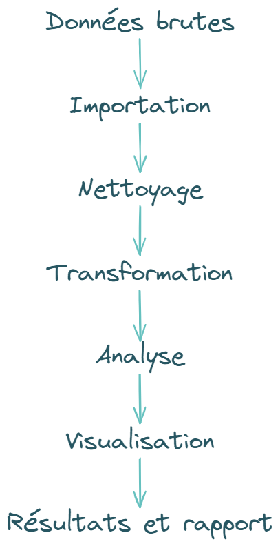{width="80%" fig-align="center" fig-alt="Chaîne de traitement."}
:::

:::{.column width="5%"}
<!-- colonne vide pour espacer les 2 colonnes de texte -->
:::

:::{.column width="65%"}
**À chaque étape, il faut pouvoir répondre à trois questions**

1. Qu'a-t'on fait ?
2. Pourquoi l'a-t'on fait ?
3. Peut-on refaire cette étape ?

`r fontawesome::fa("angles-right", fill = "#A626A4")` **Chaque opération doit être identifiable, justifiée et réexécutable**

<br />
**La reproductibilité repose sur la conservation** 

- des données
- du flux de traitement (scripts d'importation et de traitement, fonctions, méthodes statistiques utilisées)
- de la documentation (métadonnées, dictionnaire des variables, version de [R]{.softw} et des packages, instructions pour relancer l'analyse)
- des informations nécessaires à l'interprétation (tableaux, graphiques)
:::
::::
:::::

:::::{.content-visible when-format="pdf"}
{width="20%" fig-align="center" fig-alt="Chaîne de traitement."}

**À chaque étape, il faut pouvoir répondre à trois questions**

1. Qu'a-t'on fait ?
2. Pourquoi l'a-t'on fait ?
3. Peut-on refaire cette étape ?

`r fontawesome::fa("angles-right", fill = "#A626A4")` **Chaque opération doit être identifiable, justifiée et réexécutable**

**La reproductibilité repose sur la conservation** 

- des données
- du flux de traitement (scripts d'importation et de traitement, fonctions, méthodes statistiques utilisées)
- de la documentation (métadonnées, dictionnaire des variables, version de [R]{.softw} et des packages, instructions pour relancer l'analyse)
- des informations nécessaires à l'interprétation (tableaux, graphiques)
:::::

##     Comment travailler de façon reproductible avec R/RStudio ?  {.theme-section1}

###    Les projets [RStudio]{.softw}

Les projets [RStudio]{.softw} sont utiles pour 

- **organiser plus facilement son travail** : 1 projet = 1 étude  
`r fontawesome::fa("angles-right", fill = "#A626A4")` environnement isolé, pas de conflits entre projets
- **regrouper dans un même dossier tous les scripts** : scripts **R**/quarto, fonctions, données, résultats, graphiques, etc. 
- **améliorer la portabilité et faciliter les collaborations** : utilisation des chemins de fichiers relatifs  
`r fontawesome::fa("angles-right", fill = "#A626A4")` reproductibilité facilitée

:::{.callout-note title="Chemins absolus/relatifs"}
- Le chemin absolu est exprimé par rapport au disque dur, à l'ordinateur  
*Exemple* : `C:/Users/...`

- Le chemin relatif est exprimé par rapport au projet  
*Exemple* : `data/mon_fichier.csv`

`r fontawesome::fa("lightbulb", fill = "#A626A4")` **Le répertoire par défaut du projet est le dossier où est enregistré le projet sur votre machine** 
:::

--- 

####   Comment créer un projet ?

:::::{.content-visible unless-format="pdf"}

::::{.columns}
:::{.column width="47%"}
- À partir de l'icône dédiée en haut à droite de [RStudio]{.softw}
:::

:::{.column width="6%"}
<!-- colonne vide pour espacer les 2 colonnes de texte -->
:::

:::{.column width="47%"}
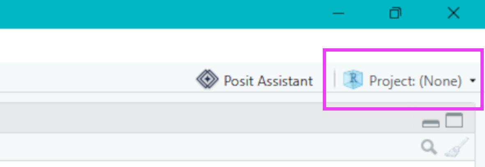{width="50%" fig-align="center" fig-alt="Icone nouveau projet RStudio."}

:::
::::

::::{.columns}
:::{.column width="47%"}
- Cliquez sur `New Project > New Directory > New Project` et complétez les informations requises 

  + le nom du dossier/projet 
  + son emplacement (dossier de votre choix)
:::

:::{.column width="6%"}
<!-- colonne vide pour espacer les 2 colonnes de texte -->
:::

:::{.column width="47%"}
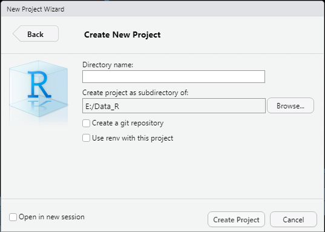{width=100%" fig-align="center" fig-alt="Menu : créer un nouveau projet."}
:::
::::
:::::

:::::{.content-visible when-format="pdf"}
À partir de l'icône dédiée en haut à droite de [RStudio]{.softw}

{width="30%" fig-align="center" fig-alt="Icone nouveau projet RStudio."}

Cliquez sur `New Project > New Directory > New Project` et complétez les informations requises 

- le nom du dossier/projet 
- son emplacement (dossier de votre choix)

{width="55%" fig-align="center" fig-alt="Créer un nouveau projet."}
:::::

:::{.callout-tip appearance="simple"}
**Quand le projet est créé**

- [RStudio]{.softw} redémarre et se place dans ce projet
- le projet apparaît dans l'onglet _Files_ de [RStudio]{.softw}

`r fontawesome::fa("lightbulb", fill = "#A626A4")` **Pour ranger efficacement les différents documents liés à l'analyse, vous pouvez créer les sous-dossiers**  
- soit en cliquant sur `New Folder` dans le menu en haut de l'onglet _Files_  
- soit de façon classique, à partir de l'explorateur de fichier de votre machine
:::

--- 

####   Comment structurer ses projets ?

**Choisissez la structuration qui vous correspond le mieux** et qui permet

- de **rassembler** tous les éléments liés au projet dans un seul dossier
- de **structurer** en dossiers/sous-dossiers pour séparer données source/créées, scripts, documentation, résultats, etc.

:::{.callout-tip appearance="simple"}
**Les données initiales et les scripts de traitement sont les plus importants**
:::

:::::{.content-visible unless-format="pdf"}
::::{.columns}
:::{.column width="30%"}
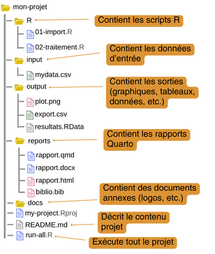{width="70%" fig-align="center" fig-alt="Structure de projet RStudio."}
:::

:::{.column width="3%"}
<!-- colonne pour espacer les 2 colonnes de texte -->
:::

:::{.column width="30%"}
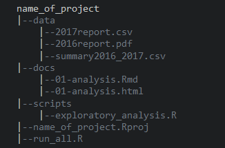{width="90%" fig-align="center" fig-alt="Exemple de structure minimale."}
:::

:::{.column width="3%"}
<!-- colonne vide pour espacer les 2 colonnes de texte -->
:::

:::{.column width="30%"}
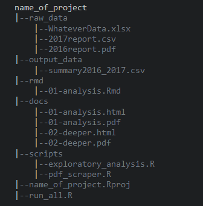{width="85%" fig-align="left" fig-alt="Exemple de structure optimale."}
:::
<center><small>Exemples de structuration de projets [R]{.softw} <br /> *Source des figures 2 & 3 : <https://learn.r-journalism.com/en/publishing/workflow/r-projects/>{target="_blank"} - Dernier accès : 2026-09-08*</small></center>
::::
:::::

:::{.content-visible when-format="pdf"}
{width="33%" fig-alt="Structure de projet RStudio."}
{width="33%" fig-alt="Exemple de structure minimale."}
{width="33%" fig-alt="Exemple de structure optimale."}

<center><small>Exemples de structuration de projets [R]{.softw} <br /> *Source (figures 2 & 3) : <https://learn.r-journalism.com/en/publishing/workflow/r-projects/>{target="_blank"} - Dernier accès : 2026-09-08*</small></center>
:::

###    Les scripts [R]{.softw}

- Ils permettent de **garder la trace** du processus de création de chaque variable, tableau, figure, etc., ce qui permet de refaire les traitements dans leur globalité  
- Ils sont **facilement partageables** avec d'autres, sous réserve de respecter des pratiques de "bon" usage  
  + coder de façon compréhensible avec des commentaires et en documentant ses fonctions  
  + donner des noms explicites aux objets et fonctions
  + utiliser les conventions de nommage, notamment pour distinguer les variables d'origine des variables créées

:::{.callout-tip appearance="simple"}
- Pour les **variables**, utiliser un **nom**  
*Exemple* : `temperature_max`
- Pour les **fonctions**, utiliser un **verbe**  
*Exemple* : `create.map` serait une fonction qui permettrait de créer une carte
- Pour **distinguer variables d'origine / variables recodées**, on peut utiliser un préfixe ou un suffixe  
*Exemple* : `age` est la variable d'origine et `age_recod` est la variable recodée
:::

---

:::{.callout-note title="Les conventions de nommage"}
Il existe différentes conventions

- **`allowercase`** : tout en minuscule, sans séparateur
- **`period.separated`** : tout en minuscule, mots séparés par des points
- **`underscore_separated`** : tout en minuscule, mots séparés par un _underscore_ (`_`)
- **`lowerCamelCase`** : première lettre des mots en majuscule, à l'exception du premier mot ; et si nom simple, tout en minuscule
- **`UpperCamelCase`** : première lettre des mots en majuscule, y compris le premier et même lorsque le nom est composé d'un seul mot

`r fontawesome::fa("lightbulb", fill = "#A626A4")` **Possibilité de mixer les conventions mais en gardant une cohérence afin de faciliter la compréhension des fichiers et du code**
:::

<br/>

:::{.callout-warning appearance="simple"}
**[R]{.softw} est sensible à la casse** ce qui signifie que `variable` et `Variable` sont deux objets différents
:::

---

####   Comment organiser ses scripts ?

- Utiliser une **convention de dénomination des fichiers** et donner des **noms explicites**
- **Séparer les traitements**  
  + import et préparation des données (nettoyage, fusion, filtrage)  
  + traitement statistique
    * analyses univariées
    * analyses bivariées
    * analyses multivariées/modélisation
  + production des résultats, rapports 

:::{.callout-tip title="Comment nommer ses scripts ?"}
- Une "bonne" pratique consiste à utiliser la structure `numero_nom_millesime.extension`  
- Le nom ne doit contenir ni caractères spéciaux (``-.,;:\/$^`) ni caractères accentués  
*Exemple* : `01_import_donnees_20250606.R` ; `02_nettoyage_donnees_20250610.R` ; `03_analyses_univariees_20250701.R`
:::

:::{.callout-note title="Ressources sur le processus d'analyse et de communication des données reproductibles"}
`r fontawesome::fa("globe", fill = "#A626A4")` [R Workflow](https://hbiostat.org/rflow){target="_blank"}

`r fontawesome::fa("globe", fill = "#A626A4")` [Reproducible analytical pipeline](https://raps-with-r.dev/)
:::

---

####   Comment structurer ses scripts ? 

::::{.columns}
:::{.column width="47%"}
1.   Commencer l'écriture du script par les **métadonnées** (titre, auteur, date, version de [R]{.softw}, encodage, etc.)
:::

:::{.column width="6%"}
<!-- colonne vide pour espacer les 2 colonnes de texte -->
:::

:::{.column width="47%"}
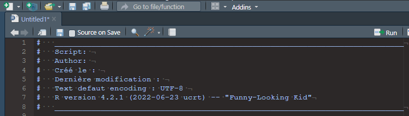{width="95%" fig-align="center" fig-alt="En-tête de script."}
:::
::::

2.   Lister les **packages** utilisés, au début des scripts, pour les identifier plus rapidement, en notant leur version

::::{.columns}
:::{.column width="47%"}
- manuellement
```r
library(tidyverse)    # v2.0.0
library(questionr)    # v0.8.2
```
:::

:::{.column width="6%"}
<!-- colonne vide pour espacer les 2 colonnes de texte -->
:::

:::{.column width="47%"}
- de façon automatisée
```r
packages_utilises <- sessionInfo()
```
:::
::::

3.   **Structurer** en parties et sous-parties, facilement grâce à l'_addin_ `strcode`  

::::{.columns}
:::{.column width="47%"}
```r
#   ____________________________________________
#   Titre 1                                 ####
##  ............................................
##  Titre 2                                 ####
```
:::

:::{.column width="6%"}
<!-- colonne vide pour espacer les 2 colonnes de texte -->
:::

:::{.column width="47%"}
`r fontawesome::fa("gears", fill = "#A626A4")` *Installation : `remotes::install_github("lorenzwalthert/strcode")`*  
:::
::::

4. **Commenter** les scripts, en particulier pour expliquer les étapes-clés (= une aide pour les autres, mais aussi pour soi, pour plus tard)

---

:::{.callout-note title="Le préfixage"}
La notation
```r
dplyr::filter(Journals, field == "Econometrics")
```
peut remplacer le code
```r
library(dplyr)
filter(Journals, field == "Econometrics")
```

**Avantages**

- Évite les conflits si plusieurs packages ont une fonction avec le même nom (mais des paramètres différents)  
*Exemple* : la fonction `filter()` existe dans les packages [{stats}]{.pkg} et [{dplyr}]{.pkg}
- Identifie le package d'où provient une fonction
- Ne charge pas la totalité d'un package pour n'utiliser qu'une seule de ses fonctions
:::

---

:::{.callout-tip title="Aide pour écrire les scripts"}
`r fontawesome::fa("gears", fill = "#A626A4")` Activer les options de diagnostic pour signaler les erreurs dans les scripts sous [RStudio]{.softw} : `Tools > Global Options > Code > Diagnostics`

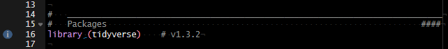{width="100%" fig-align="center" fig-alt="Diagnostic de script."}

`r fontawesome::fa("r-project", fill = "#A626A4")` package [[{styler}](https://github.com/r-lib/styler){target="_blank"}]{.pkg} : mettre en forme le code selon le [Tidyverse Style Guide](https://style.tidyverse.org/index.html){target="_blank"} (ou selon son propre style)  

`r fontawesome::fa("r-project", fill = "#A626A4")` package [[{lintr}](https://lintr.r-lib.org/){target="_blank"}]{.pkg} : vérifier que le code est conforme à un guide de style donné
:::

---

###    Le fichier README

Ce fichier, généralement un fichier au format .txt ou .md (markdown), qui présente le **projet**, sa **structuration** et les **étapes d'exécution des différents script** pour comprendre, reproduire et utiliser le projet, est à placer dans le dossier du projet

**Exemple de fichier README**

```md
# VisuR_2026

Projet du cours "Visualisation des données sous R" pour l'année universitaire 2026-2027

## Structure
- data/ : données 
    ├── sources/ : données sources, données brutes
    └── produites/ : données produites
- scripts/ : scripts R, qmd
- outputs/ : graphiques et tableaux exportés
- docs/ : rapports et supports

## Comment reproduire les analyses
1. Ouvrir le projet `VisuR_2026.Rproj`
2. Exécuter les scripts dans l'ordre (01_import.R, 02_nettoyage.R, etc.)
3. Les graphiques générés sont enregistrés dans le dossier outputs
4. Le rapport d'étude est enregistré dans le dossier docs
```

---

###    Citer la version de [R]{.softw} ainsi que les packages que vous avez utilisés dans vos travaux

**Avec la fonction `citation()`**

<br />

::::{.columns}
:::{.column width="45%"}
####   Pour citer la version de [R]{.softw}

```{r}
#| label: citeR

# Citer R
citation()
```
:::

:::{.column width="5%"}
<!-- colonne vide pour espacer les 2 colonnes de texte -->
:::

:::{.column width="50%"}
####   Pour citer un package

```{r}
#| label: citePkg

# Citer un package (ici ggplot2)
citation("ggplot2")
```
:::
::::

<!-- EXERCICE 1. -->
##     `r fontawesome::fa("keyboard")` À VOUS DE JOUER ! {background-color="#222251" .purplewhite-text}
:::{#exr-seance1_1}
01. Vérifier que [R] et [RStudio] sont installés
02. Définir l'encodage UTF-8 
03. Vérifier que le package `{tidyverse}` est installé et l'installer si ce n'est pas le cas

**`r fontawesome::fa("circle-question", fill = "#FFFFFF")` Quelle est la version de [R] et des packages `{tidyverse}` et `{ggplot2}` que vous utilisez ?**

04. Sous [RStudio], créer un projet nommé **`VisuR_exercices`**
05. Créer les dossiers nécessaires pour une bonne structuration de votre travail
06. Déposer le fichier `communes.csv` dans le dossier adéquat de votre projet
07. Dans votre projet [RStudio], créer un script [R] nommé **`01_Exercices_VisuR.R`**, qui servira pour les exercices à venir, durant lesquels vous aurez besoin des packages `{readr}` et `{dplyr}` 
08. Commencer l'écriture de ce script avec ces premiers éléments
:::

##     {background-color="#222251" .unlisted .unnumbered .purple-text}
:::{#sol-seance1_1}

**Proposition de structuration du projet**
```md
VisuR_exercices/
├── data/
│   ├── sources/
│   │   └── communes.csv
│   └── produites/
├── scripts/
│   └── 01_Exercices_VisuR.R
├── figures/
├── results/
├── README.md
└── VisuR_exercices.Rproj
```

**Script 01_Exercices_VisuR.R**
```{r}
#| label: exr11
#| eval: false
#| code-fold: true

#   ____________________________________________________________________________
#   Script : Script pour les exercices "VisuR"
#   Auteur : Sandrine Lyser
#   Date   : 02 oct. 2026
#   Dernière modification : sys.date()
#   Text encoding : UTF-8
#   R version : R version 4.6.0 (2026-04-24 ucrt) -- "Because it was There"
#   ____________________________________________________________________________

#   ____________________________________________________________________________
#   Packages                                                                ####

library(readr)    # v2.2.0
library(dplyr)    # v1.2.1

```
:::

##     L'univers du `tidyverse` {.theme-section1}

###    Présentation générale et installation

- **Ensemble de packages reprenant des opérations courantes de [R]{.softw}, qui partagent une même philosophie et syntaxe pour travailler ensemble et faciliter, la manuipulation, l'analyse et la visualisation des données**  
- L'accent est mis sur la lisibilité et la chaîne d'opérations, via l'opérateur _pipe_ `|>`  
`r fontawesome::fa("angles-right", fill = "#A626A4")` code dans l'ordre logique des étapes, moins d'objets intermédiaires et de parenthèses imbriquées que dans la syntaxe [R]{.softw} de base  

`r fontawesome::fa("gears", fill = "#A626A4")` La commande `install.packages("tidyverse")` installe simultanément plusieurs packages

::::{.columns}
:::{.column width="47%"}
  + [[{dplyr}]{.pkg}](https://dplyr.tidyverse.org/){target="_blank"} : manipulation des données
  + [[{forcats}]{.pkg}](https://forcats.tidyverse.org/){target="_blank"} : traitement des variables qualitatives
  + [[{ggplot2}]{.pkg}](https://ggplot2.tidyverse.org/){target="_blank"} : visualisation des données
  + [[{lubridate}]{.pkg}](https://lubridate.tidyverse.org/){target="_blank"} : manipulation des dates et heures
  + [[{purrr}]{.pkg}](https://purrr.tidyverse.org/){target="_blank"} : programmation
:::

:::{.column width="6%"}
<!-- colonne vide pour espacer les 2 colonnes de texte -->
:::

:::{.column width="47%"}
  + [[{readr}]{.pkg}](https://readr.tidyverse.org/){target="_blank"} : import de données
  + [[{stringr}]{.pkg}](https://stringr.tidyverse.org/){target="_blank"} : manipulation des chaînes de caractères
  + [[{tibble}]{.pkg}](https://tibble.tidyverse.org/){target="_blank"} : version modernisée des _dataframes_, plus pratiques à utiliser que les _dataframes_ "classiques"
  + [[{tidyr}]{.pkg}](https://tidyr.tidyverse.org/){target="_blank"} : nettoyage, remise en forme des données
:::
::::
`r fontawesome::fa("lightbulb", fill = "#A626A4")` La commande `library("tidyverse")` charge simultanément ces neuf packages au coeur du tidyverse

---

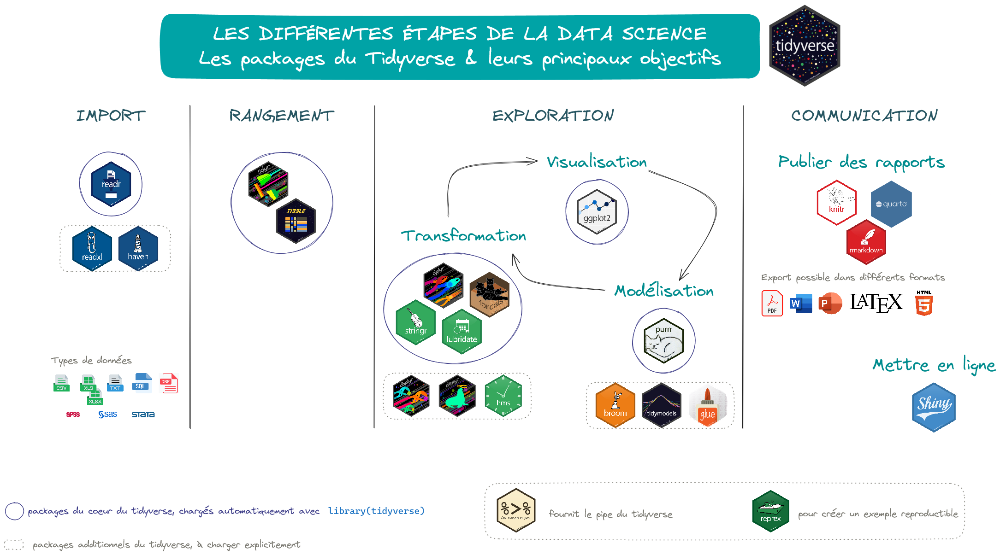{width="90%" fig-align="center" fig-alt="Datascience et tidyverse."}

---

####   L'opérateur _pipe_

- Opérateur qui permet d'enchaîner des opérations : il prend la sortie d'une fonction (ou d'une expression) et la passe automatiquement comme **premier** argument à la fonction suivante
- Initialement fourni dans le package [{magrittr}](https://magrittr.tidyverse.org/){target="_blank"} et noté `%>%`
- Implémenté dans le langage **R** de base depuis la version 4.1.0 et noté `|>`

```r
data |>
  fonction1() |>
  fonction2() |>
  fonction3()
# équivaut à
fonction3(fonction2(fonction1(data)))
```

<br />

:::{.callout-tip appearance="simple"}
**Il est recommandé d'utiliser le pipe natif de R** `|>`

<br />
`r fontawesome::fa("gears", fill = "#A626A4")` **Comment utiliser le pipe natif sous RStudio ?**  
- Allez dans `Tools > Global Options > Code > Editing`  
- Cochez `Use native pipe operator, |> (requires R 4.1+)`
:::

---

####   Les *tibbles*

- **Version modernisée des _dataframes_**, proposée dans le cadre du [`tidyverse`](https://www.tidyverse.org/){target="_blank"}
- Plus pratiques à utiliser que les _dataframes_ "classiques"
- Plus rapides à manipuler (et plus stables) que les _dataframes_
- Il est possible de convertir d'un type à l'autre
  + _dataframe_ $\rightarrow$ _tibble_ : avec la fonction `as_tibble()` du package [{tibble}](https://tibble.tidyverse.org/){target="_blank"}
  + _tibble_ $\rightarrow$ _dataframe_ : avec la fonction **R** de base `as.data.frame()`

`r fontawesome::fa("r-project", fill = "#A626A4")` Pour connaître le type d'objet et savoir si on a un _dataframe_ ou un _tibble_, on peut utiliser la fonction `str()`

---

::::{.content-visible unless-format="pdf"}
:::{.callout-note title="Aperçu des formats"}
#####  dataframe {.unlisted .unnumbered}
```{r}
#| label: dataframe 
#| width: 150

Journals |> 
  head(2)
```

<br />

#####  tibble {.unlisted .unnumbered}
```{r}
#| label: tibble

Journals |> 
  as_tibble() |> 
  head(2)
```
:::
::::

::::{.content-visible when-format="pdf"}
#####  Aperçu des formats {.unlisted .unnumbered}
**_dataframe_**
```{r}
#| label: dataframepdf

Journals |> 
  head(2)
```

**_tibble_**
```{r}
#| label: tibblepdf

Journals |> 
  as_tibble() |> 
  head(2)
```
::::

##     Manipulations des données {.theme-section1}

###    Import/Export des données

- Depuis/vers des formats "plats" ou délimités (.csv, .txt)
- Depuis/vers des fichiers Excel ou issus d'autres logiciels de statistique (Stata, SPSS, etc.)
- Depuis/vers des bases de données relationnelles

<br />

:::{.callout-tip title="Pour l'import, bien étudier le jeu de données source, à l'aide des questions suivantes"}
1. La première ligne contient-elle le nom des variables ?  
2. Quel est le séparateur des colonnes : `,`, `;`, espace(s), `\t` ?  
3. Quel est le caractère utilisé pour indiquer les décimales : le point (à l'anglo-saxonne) ou la virgule (à la française) ?  
4. Les valeurs textuelles sont-elles encadrées par des guillemets ? Si oui, s'agit-il de guillemets simples (`'`) ou de guillemets doubles (`"`) ?  
5. Y a-t-il des valeurs manquantes ? Si oui, comment sont-elles indiquées ?  
:::

---

####   Les fonctions d'import

| Type de fichier | Séparateur de colonnes | Séparateur décimal | Tidyverse              | Base R                 |
|:----------------|:-----------------------|:-------------------|:-----------------------|:-----------------------|
| Délimité        | `,`                    | `.`                | `readr::read_csv()`    | `read.csv()`           |
|                 | `;`                    | `,`                | `readr::read_csv2()`   | `read.csv2()`          |
|                 | un espace (ou plus)    | `.`                | `readr::read_table()`  | `read.table()`         |
|                 | `\t`                   | `.`                | `readr::read_delim()`  | `read.delim()`         |
|                 | `\t`                   | `,`                | `readr::read_delim2()` | `read.delim2()`        |
| Excel           |                        |                    | `readxl::read_excel()` | `xlsx::read.xlsx()`    |
| SPSS            |                        |                    | `haven::read_spss()`   | `foreign::read.spss()` |
|                 |                        |                    | `haven::read_sav()`    |                        |
| Stata           |                        |                    | `haven::read_stata()`  | `foreign::read.dta()`  |
| SAS             |                        |                    | `haven::read_sas()`    | `foreign::read.ssd()`  |
| dBase           |                        |                    |                        | `foreign::read.dbf()`  |

: {tbl-colwidths="[10, 20, 20, 25, 25]"}

---

####   Les fonctions d'export

| Type de fichier | Tidyverse                          | Base R                                     |
|:----------------|:-----------------------------------|:-------------------------------------------|
| .txt            | `readr::write_delim(delim = "\t")` | `write.table()`                            |
| .csv            | `readr::write_csv()`               | `write.csv()`                              |
| .xlsx           | `openxlsx2::write_xlsx()`          |                                            |
|                 | `writexl::write_xlsx()`            |                                            |
| .dbf            |                                    | `foreign::write.dbf()`                     |
| .sav (SPSS)     | `haven::write_sav()`               | `foreign::write.foreign(package = "SPSS")` |
| .dta (Stata)    | `haven::write_dta()`               | `foreign::write.dta()`                     |

---

####   Exemple d'import pour un fichier .csv

```r
readr::read_csv("file.csv"
                # si la première ligne contient le nom des variables :
                , col_names = TRUE)
```

<br />

:::{.callout-tip title="Zoom sur la fonction `read_csv2()`"}
La fonction `readr::read_csv2()` considère par défaut que le séparateur de colonnes est le point-virgule et que la virgule sert de séparateur décimal

La fonction en langage [R]{.softw} de base `read.csv2()` a les mêmes paramètres par défaut

`r fontawesome::fa("lightbulb", fill = "#A626A4")` **Utiliser ces fonctions lorsque les fichiers .csv ont ces caractéristiques**
:::

###    Manipulations sur les observations et les variables avec le package [[{dplyr}]{.softw}](https://dplyr.tidyverse.org/){target="_blank"}

**Principales fonctions utiles pour**  

- **les lignes/observations**  
  + `filter()` : sélectionner/filtrer des observations
  + `distinct`: afficher les observations distinctes
- **les colonnes/variables**  
  + `select()` : sélectionner/extraire des variables
  + `mutate()` : créer des variables
  + `relocate()` : changer l'ordre d'une colonne
  + `rename()` : changer le nom des variables

:::{.callout-note title="Aide-mémoire des principales fonctions du package [{dplyr}]{.pkg}"}
`r fontawesome::fa("r-project", fill = "#A626A4")` [_Cheatsheet_](https://rstudio.github.io/cheatsheets/data-transformation.pdf){target="_blank"}
:::

---

####   Filtrer des observations avec la fonction `filter()`

::::{.columns}
:::{.column width="47%"}
#####  Selon un seul critère  

```{r}
#| label: filtersimple

# Revues dans le domaine de la Démographie
Journals |> 
  dplyr::filter(field == "Demography")
```
:::

:::{.column width="6%"}
<!-- colonne vide pour espacer les 2 colonnes de texte -->
:::

:::{.column width="47%"}
#####  Selon plusieurs critères

En utilisant les opérateurs logiques

```{r}
#| label: filterAND

# Revues de Démographie dont l'abonnement coûte moins de 100$
Journals |> 
  dplyr::filter(field == "Demography" & libprice < 100)
```
:::
::::

---

:::{.callout-note title="Opérateurs logiques les plus courants"}

| **Opérateur** | **Description**                 |
|:--------------|:--------------------------------|
| `<`           | Inférieur à                     |
| `<=`          | Inférieur ou égal à             |
| `>`           | Supérieur à                     |
| `>=`          | Supérieur ou égal à             |
| `==`          | Exactement égal à               |
| `!=`          | Différent de                    |
| `|`           | Ou                              |
| `&`           | Et                              |
| `%in%`        | Appartient à                    |
| `is.na()`     | Est une donnée manquante        |
| `!is.na()`    | N'est pas une donnée manquante  |

:::

---

####   Afficher les valeurs distinctes avec la fonction `distinct()`

On peut afficher les valeurs distinctes selon une (ou plusieurs) variables

```{r}
#| label: distinct

# Afficher les valeurs distinctes de 'field'

Journals |> 
  distinct(field)
```

`r fontawesome::fa("lightbulb", fill = "#A626A4")` **Cette fonction peut aussi servir à supprimer les doublons dans un jeu de données**

---

####   Sélectionner des colonnes avec la fonction `select()`

#####  Une seule colonne

:::::{.columns}
::::{.column width="47%"}
```{r, output.lines=10}
#| label: select

# Sélection de la variable 'pub'
Journals |>
  dplyr::select(pub)
```
::::

::::{.column width="6%"}
<!-- colonne vide pour espacer les 2 colonnes de texte -->
::::

::::{.column width="47%"}
:::{.callout-tip appearance="simple"}
On peut également utiliser la fonction `pull()` pour sélectionner une (et une seule) colonne

```{r, output.lines=10}
#| label: pull

# Sélection de la variable 'pub'
Journals |>
  dplyr::pull(pub)
```

- Quelle différence avec `select()` ?  
Le format de sortie est différent :  
  + la fonction `select()` renvoie la colonne sous forme de _dataframe_
  + la fonction `pull()` renvoie une colonne sous forme de vecteur

:::
::::
:::::

---

#####  Plusieurs colonnes

::::{.columns}
:::{.column width="47%"}
###### En listant la/les variables à conserver</span>

```{r, output.lines=3}
#| label: selectMultiple

# Sélection des variables "field" et "libprice"
Journals |>
  dplyr::select(c(field, libprice))
```
:::

:::{.column width="6%"}
<!-- colonne vide pour espacer les 2 colonnes de texte -->
:::

:::{.column width="47%"}
###### En listant la/les variables à supprimer

```{r, output.lines=3}
#| label: selectNot

# Sélection des variables sauf "title" et "pub"
Journals |>
  dplyr::select(-c(title, pub))
```

:::
::::

:::::{.callout-tip appearance="simple"}

::::{.columns}
:::{.column width="47%"}
Les tests sur le nom des variables peuvent se faire avec différentes fonctions :

- `contains()` 
- `starts_with()`
- `ends_with()` 
- `matches()`
:::

:::{.column width="6%"}
<!-- colonne vide pour espacer les 2 colonnes de texte -->
:::

:::{.column width="47%"}

<br />

```{r, output.lines=2}
#| label: contains

# Sélection des variables dont le nom contient "s"
Journals |>
  dplyr::select(contains("s"))
```
:::
::::

:::::

---

####   Créer/ajouter de nouvelles variables avec `mutate()`

::::{.columns}
:::{.column width="47%"}

<br />

```{r, output.lines=4}
#| label: mutate

# Ajout de la variable 'anciennete'
Journals |>
  mutate(anciennete = 2026 - date1) -> Journals

names(Journals)
```

<br />
`r fontawesome::fa("triangle-exclamation", fill = "#A626A4")` **Penser à affecter la modification au jeu de données**
:::

:::{.column width="6%"}
<!-- colonne vide pour espacer les 2 colonnes de texte -->
:::

:::{.column width="47%"}
- La fonction `mutate()` peut également 

  + modifier une variable existante si le nom est le même que celui d'une colonne existante
  + supprimer une variable en fixant sa valeur à `NULL`

```{r, output.lines=4}
#| label: mutateNULL

# Suppression de la variable 'charpp'
Journals |>
  mutate(charpp = NULL) |>
  names()
```
:::
::::

---

#####  Appliquer des règles conditionnelles

###### La fonction `if_else()`

```r
Journals |> 
  mutate(cl_anciennete = if_else(anciennete < 30, " Moins de 30 ans",
                                 if_else(anciennete >= 30  & anciennete < 50, "30 à 49 ans",
                                         if_else(anciennete >= 50 & anciennete < 100, "50 à 99 ans",
                                                 if_else(anciennete >= 100 & anciennete < 150, 
                                                         "100 à 149 ans", "150 ans et plus"))))) -> Journals
```

<br />

###### La fonction `case_when()`

```r
Journals |> 
  mutate(cl_anciennete = case_when(anciennete < 30 ~ "Moins de 30 ans",
                                   anciennete >= 30  & anciennete < 50 ~ "30 à 49 ans",
                                   anciennete >= 50 & anciennete < 100 ~ "50 à 99 ans",
                                   anciennete >= 100 & age < 150 ~ "100 à 149 ans", 
                                   anciennete >= 150 ~ "150 ans et plus",
                                   TRUE ~ "ERREUR")) -> Journals
```

---

####   Réordonner les variables avec la fonction `relocate()`

`r fontawesome::fa("lightbulb", fill = "#A626A4")` Les nouvelles variables ajoutées avec `mutate()` se positionnent toujours à la fin du jeu de données  

`r fontawesome::fa("angles-right", fill = "#A626A4")` Il est possible de les positionner où l'on souhaite, avec la fonction `relocate()`

```{r}
#| label: relocateafter

# On repositionne la variable 'anciennete' après la variable 'date1' 
Journals |> 
  relocate(anciennete, .after = date1) -> Journals

# Vérification
Journals |> 
  names()
```

<br />
On aurait également pu obtenir le même résultat avec le paramètre `.before`

```r
Journals |> 
  relocate(anciennete, .before = oclc) -> Journals
```

---

####   Modification du nom des colonnes avec `rename()`

```{r}
#| label: rename

# On renomme la colonne 'pub' en 'publisher'
Journals |>
  dplyr::rename(publisher = pub) -> Journals

# Vérification : affichage du nom des colonnes
Journals |> 
  names()
```

<br />
`r fontawesome::fa("triangle-exclamation", fill = "#A626A4")` **Ne pas oublier d'affecter la modification au jeu de données**

<!-- EXERCICE 2. -->
##     `r fontawesome::fa("keyboard")` À VOUS DE JOUER ! {background-color="#222251" .purplewhite-text}
:::{#exr-seance1_2}
On se place toujours dans le projet **`VisuR_exercices`** et le fichier *01_Exercices_VisuR.R*, et on utilise les fonctions du `tidyverse`

01. Importer les données du fichier `communes.csv` dans un objet `communes`
02. Quel est le type de cet objet et sa structure (nombre de lignes et de colonnes) ?
03. La variable `CODGEO` est un code. Transformer en variable caractère avec la fonction `as.character()` 
04. Combien de communes distinctes y a-t'il dans `communes` ? et combien d'années ? 
05. Filtrer les données pour n'afficher que les observations de l'année 2018
06. Créer la variable `surface = surface_urbaine + surface_verte` dans votre jeu de données. Elle doit se trouver avant la variable `surface_urbaine`
07. Afficher la colonne commune et toutes celles qui commencent par "surface_"
:::

##     {background-color="#222251" .unlisted .unnumbered .purple-text}
:::{#sol-seance1_2}

Ces commandes sont à écrire dans le script *01_Exercices_VisuR.R* créé dans l'exercice 1.
```{r}
#| label: exr12
#| eval: false
#| code-fold: true

#   ____________________________________________________________________________
#   01. Import des données                                                  ####

#   Le fichier csv est dans le dossier 'data'
#   Les colonnes sont séparées par un ';' et les décimales par une ',' -> on peut utiliser read_csv2
readr::read_csv2("data/communes.csv") -> communes


#   ____________________________________________________________________________
#   02. Type et structure de 'communes'                                     ####

class(communes)
# ==>  L'objet 'communes' est de type tibble. Il contient 84 lignes et 16 colonnes


#   ____________________________________________________________________________
#   03. Transformer la variable `CODGEO`en variable caractères              ####
communes <- communes |>
  mutate(CODGEO = as.character(CODGEO))


#   ____________________________________________________________________________
#   04. Nombre de communes et d'années distinctes                           ####
communes |>
  distinct(commune)
# ==>  Il y a 28 communes différentes

communes |>
  distinct(annee)
# ==>  Il y a trois années différentes : 2018, 2020 et 2022


#   ____________________________________________________________________________
#   05. Affichage des observations de l'année 2018                          ####
communes |>
  filter(annee == 2018)
# ==>  Si l'on filtre les observations de l'année 2018, on n'affiche que 28 observations

#   ____________________________________________________________________________
#   06. Création de la variable 'surface'                                   ####
communes <- communes |>
  mutate(surface = surface_urbaine + surface_verte) |>
  # positionnement avant la variable 'surface_urbaine'
  relocate(surface, .before = surface_urbaine)

#   ____________________________________________________________________________
#   07. Affichage de la colonne 'commune' et des colonnes "surface_"        ####
communes |>
  select(commune, starts_with("surface_"))
```
:::

#      Séance 2. Premiers graphiques avec {ggplot2} {.theme-seance}

##     Objectifs pédagogiques

À l'issue de cette séance, vous serez capable de

- comprendre la logique de [{ggplot2}]{.pkg}
- transformer les données dans un format adapté pour les graphiques

##     Visualisations graphiques avec {ggplot2} {.theme-section1}

###    Le package [[{ggplot2}]{.pkg}](https://ggplot2.tidyverse.org/){target="_blank"}
Ce package produit des graphiques en utilisant une grammaire particulière (*grammar of graphics*)

::::::{.content-visible unless-format="pdf"}

:::::{.columns}
::::{.column width="47%"}
- **Installation**
```r 
install.packages("ggplot2")
```
- **Chargement**
```r
library(ggplot2)
```
- **Création d'un graphique**  
Le principe consiste à initialiser un graphique avec la commande `ggplot()` puis à construire le graphique, couche par couche avec le signe `+`
```r
ggplot(data = dataframe,
       aes = (...)) +
       geom_*(...) +
       ...
```
::::

::::{.column width="6%"}
<!-- colonne vide pour espacer les 2 colonnes de texte -->
::::

::::{.column width="47%"}
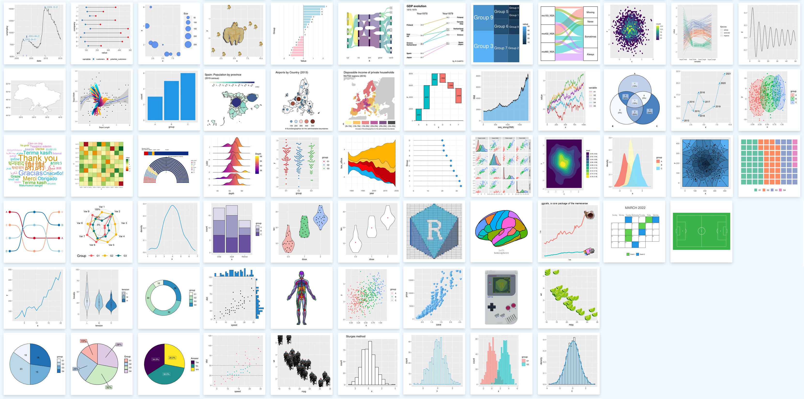{fig-align="center" fig-alt="Exemples de graphiques ggplot2."}
<center>Source : <https://r-charts.com/ggplot2/>{target="_blank"}</center>

:::{.callout-note appearance="simple"}
- Le système de création des graphiques est basé sur *The Grammar of Graphics* [@Wilkinson1999; -@Wilkinson2005]
- **L'idée est de décomposer la construction d'un graphique en plusieurs éléments, que l'on appelle _layers_ (couches, en français)**
:::
::::
:::::
::::::

::::::{.content-visible when-format="pdf"}
- **Installation**
```r
install.packages("ggplot2")
```
- **Chargement**
```r
library(ggplot2)
```
- **Création d'un graphique**  
Le principe consiste à initialiser un graphique avec la commande `ggplot()` puis à ajouter des couches permettant de représenter les données et mettre en forme le graphique
```r
ggplot(data = dataframe,
       aes = (x, y)) +
       ...
```

Voir le site <https://r-charts.com/ggplot2/>{target="_blank"} pour une galerie de graphiques.

:::{.callout-note appearance="simple"}
Le système de création des graphiques est basé sur *The Grammar of Graphics* [@Wilkinson1999; -@Wilkinson2005]  
- **L'idée est de décomposer la construction d'un graphique en plusieurs éléments, que l'on appelle _layers_ (couches, en français)**
:::
::::::

###    La grammaire ggplot
Une structure en 7 _layers_ superposables

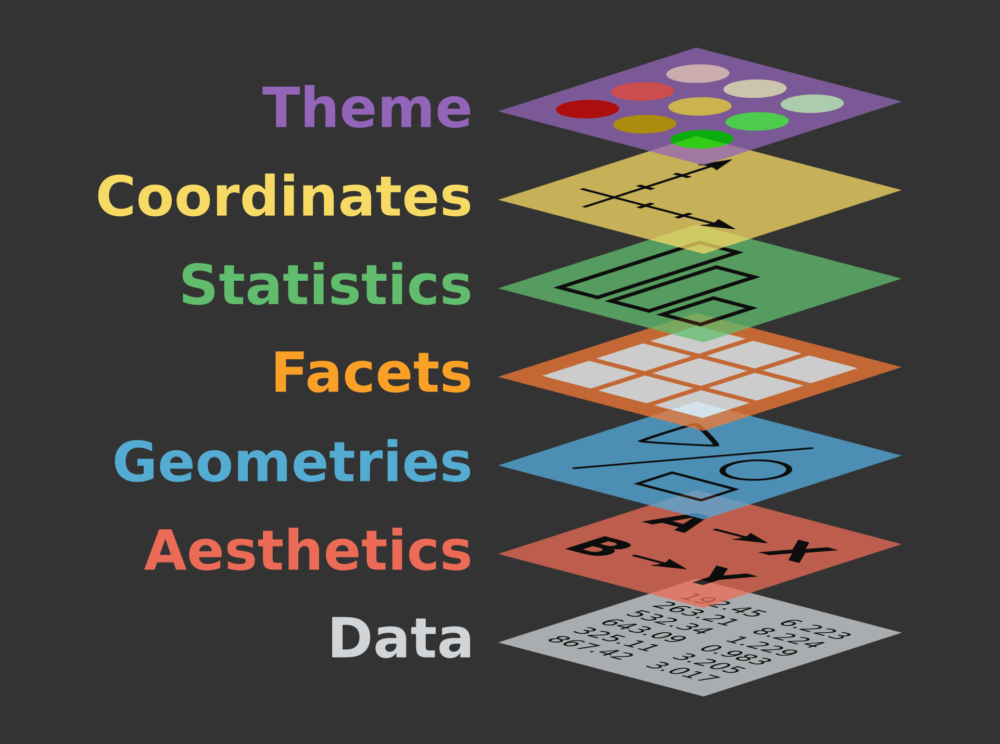{width="45%" fig-align="center" fig-alt="Couches ggplot."}

<center><p>Source : [ThinkR (2016)](https://thinkr.fr/guide-survie-ggplot2-datajournalistes/){target="_blank"}</p></center>

:::{.callout-note appearance="simple"}
**A minima : `un graphique = data + aesthetics + geometries`**  
Les quatre autres _layers_ permettent de paramétrer plus finement le graphique
:::

###    Construction d'un graphique, couche par couche

1. On initialise le graphique par `ggplot()` puis on associe les données (_dataframe_ ou _tibble_) avec `data` et les attributs esthétiques avec `aes()`
```{r}
#| label: aes
#| eval: true
#| fig-height: 2
#| fig-align: center
#| output-location: column

ggplot(data = Journals) +
  aes(x = oclc, y = libprice)
```
<small>`r fontawesome::fa("circle-exclamation", fill = "#A626A4")` **À ce stade, on visualise le canevas du graphique mais les données ne sont pas encore représentées**</small>  
2. On ajoute une couche de géométrie pour dessiner les données (= type de graphique)
```{r}
#| label: geom
#| fig-height: 2
#| fig-align: center
#| output-location: column

# Nuage de points avec geom_point
ggplot(data = Journals) +
  aes(x = oclc, y = libprice) +
  geom_point()
```
<small>`r fontawesome::fa("angles-right", fill = "#A626A4")` **Avec `geom_*()`, les données sont représentées sur le graphique**</small>  
3. On ajoute ensuite des couches pour ajuster la mise en forme du graphique

---

####   `aes()` : définir les paramètres esthétiques
On précise quelles variables contrôlent les propriétés visuelles du graphique
<center>

:::{.small-table}

|**_Aesthetic_** | **Description**                                   |
|:---------------|:--------------------------------------------------|
| x              | variable en abscisse                              |
| y              | variable en ordonnée                              |
| colour         | couleur du contour (des points, lignes, etc.)     |
| fill           | couleur de remplissage (des points, formes, etc.) |
| size           | taille des points, épaisseur des lignes           |
| alpha          | transparence                                      |
| linetype       | motif des tirets des lignes                       |
| shape          | type de formes                                    |

:::

</center>

---

####   `geom_*()` : définir le type de graphique

**Principales geométries**

:::{.small-table}

| **_Geometry_**     | 	**Description** 	  | **Aspects esthétiques**                                                                                                 |
|:-------------------|:---------------------|:------------------------------------------------------------------------------------------------------------------------|
| `geom_point()` 	   | Nuage de points      | **x**, **y**, colour, fill, group, shape, size, alpha                                                                   |
|` geom_bar()` 	     | Diagramme en barres  | **x**, **y**, colour, fill, group, linetype, linewidth, alpha                                                           |
| `geom_histogram()` | Histogramme 	        | *identiques à `geom_bar()`*                                                                                             |
| `geom_boxplot()`   | Boîte à moustaches 	| **x** OU **y**, **ymin** OU **xmin**, **ymax** OU **xmax**, colour, fill, group, linetype, linewidth, shape, size, alpha|
| `geom_density()` 	 | Densité 	            | **x**, **y**, colour, fill, group, linetype, linewidth, alpha                                                           |
| `geom_line()` 	   | Courbe  	            | **x**, **y**, colour, group, linetype, linewidth, alpha                                                           |
| `geom_text()` 	   | Texte 	              | **x**, **y**, label, colour, angle, group, hjust, lineheight, size, vjust, alpha                                        |
| `geom_label()` 	   | Texte                | *identiques à `geom_text()`* + fill                                                                                     |

: Les aspects esthétiques obligatoires sont indiqués en gras

:::

`r fontawesome::fa("lightbulb", fill = "#A626A4")` **Possibilité d'ajouter plusieurs fonctions `geom_*()` sur un même graphique**
</small>

:::{.callout-note appearance="simple"}
`r fontawesome::fa("r-project", prefer_type = "solid", fill = "#A626A4")` L'ensemble des fonctions `geom_` est détaillé dans la _cheatsheet_ [{ggplot2}]{.pkg}

- version [{.center width=5%}](https://rstudio.github.io/cheatsheets/translations/french/data-visualization_fr.pdf){target="_blank"}
- version [{.center width=5%}](https://rstudio.github.io/cheatsheets/data-visualization.pdf){target="_blank"}
:::

---

:::{.callout-tip title="Une règle simple à retenir"}
- **Ce qui se trouve dans `aes()` varie avec les données** = une variable détermine une esthétique
- **Les esthétiques placées en dehors de `aes()`, dans `geom_*()`, correspondent à un réglage fixe** = une valeur fixe règle l'apparence de la couche `geom_*()`

_Exemples_

```{r}
#| label: aescolour
#| fig-height: 3
#| fig-align: center
#| output-location: column

# Points colorés selon les valeurs de "society"
ggplot(data = Journals) +
  aes(x = oclc, y = libprice,
      colour = society) +
  geom_point()
```

```{r}
#| label: geomcolor
#| fig-align: center
#| fig-height: 3
#| output-location: column

# Points de couleur verte"
ggplot(data = Journals) +
  aes(x = oclc, y = libprice) + 
  geom_point(color = "#275662")
```
:::

---

####   `stat_*()` : effectuer un calcul sur les données avant leur affichage

`r fontawesome::fa("angles-right", fill = "#A626A4")` Ce qui est affiché sur le graphique : comptage, moyenne, etc.

**Principales fonctions**

:::{.small-table}

| ***Fonctions***    | 	**Description** 	                                                                |
|:-------------------|:-----------------------------------------------------------------------------------|
| `stat_identity()`  | Données brutes, sans transformation                                                |
|` stat_count()` 	   | Comptage par modalité d'une variable catégorielle                                  |
| `stats_bin()`      | Découpage d'une variable continue en classes (_bins_)                              |
| `stat_summary()`   | Résumé d'une variable pour chaque modalité d'une autre variable                    |
| `stats_boxplot()`  | Calcul des statistiques de la boîte à moustaches (médiane, quartiles, moustaches)  |
| `stats_sum()` 	   | Comptage de points superposés                                                      |

:::

*Exemple*
```{r}
#| label: statsummary
#| fig-align: center
#| fig-height: 3.5
#| output-location: column

# Affichage sur chaque boxplot 
# de la moyenne de 'libprice'
ggplot(data = Journals) +
  aes(x = society, y = libprice) +
  geom_boxplot() +
  stat_summary(geom = "point",
               fun = "mean",
               colour = "#A626A4", 
               shape = 17, 
               size = 4)
```

---

####   Équivalences entre `geom_*()` et `stat_*()`
**Les deux sont souvent interchangeables, c'est une différence de point de vue :**  `geom_*()` priorise la forme graphique (barres, points, lignes) ; `stat_*()` priorise la transformation statistique (comptage, résumé, etc.)  

:::{.callout-tip appearance="minimal"}
`r fontawesome::fa("angles-right", fill = "#A626A4")` On peut reproduire le graphique précédent avec `geom_point()`

```{r}
#| label: geompointsummary
#| fig-align: center
#| fig-height: 2.5
#| output-location: column

ggplot(data = Journals) +
  aes(x = society, y = libprice) +
  geom_boxplot() +
  geom_point(stat = "summary",
             fun = "mean",
             colour = "#A626A4", shape = 17, size = 4)
```
:::

**Principales correspondances**

:::{.small-table}

| **_Geometry_**     | **_Statistics_**  |
|:-------------------|:------------------|
| `geom_bar()` 	     | `stat_count()`    |
| `geom_histogram()` | `stat_bin()`      |
| `geom_boxplot()`   | `stat_boxplot()`  |
| `geom_density()` 	 | `stat_density()`  |
| `geom_quantile()`  | `stat_quantile()` |
| `geom_count()`     | `stat_sum()`      |
| `geom_dotplot()`   | `stat_bindot()`   |

:::

###    Éléments de personnalisation des graphiques pour faciliter leur lecture

- `scale_...()` : modifier les attributs liés
  + aux axes (échelles, limites, titre, format des chiffres par exemple)
  + aux données représentées (couleurs, etc.)
- `ggtitle()` : ajouter ou modifier uniquement le titre principal du graphique
- `xlab()` : modifier uniquement l'intitulé de l'axe des abscisses
- `ylab()` : modifier uniquement l'intitulé de l'axe des ordonnées
- `labs(title = ..., subtitle = ..., caption = ..., x = ..., y = ...)` : modifier plusieurs étiquettes (titre, sous-titre, légende, axes) en une seule commande

:::{.callout-tip appearance="simple"}
Les fonctions `ggtitle()`, `xlab()`, `ylab()` sont pratiques pour de petits ajouts rapides  
La fonction `labs()` offre plusieurs options de personnalisation des titres et labels, en une seule commande
:::

<br />
`r fontawesome::fa("lightbulb", fill = "#A626A4")` **Si certains éléments peuvent être omis pour épurer le graphique sans nuire à sa compréhension (axe des abscisses, cadre, 3D), il est conseillé de faire commencer l'axe des ordonnées à 0**

---

::::{.columns}
:::{.column width="45%"}
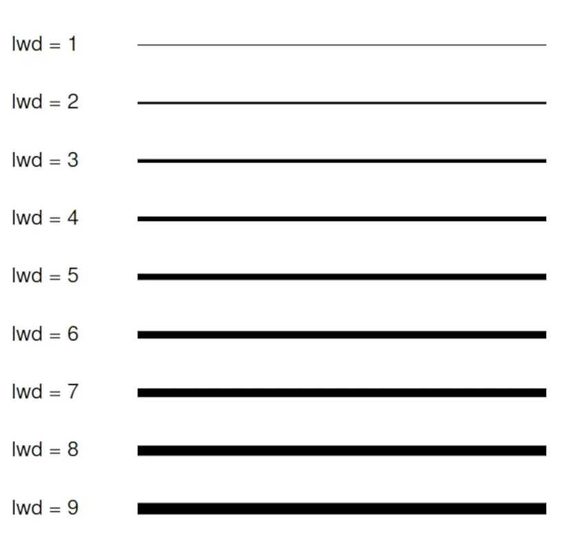{width="48%" fig-alt="Épaisseurs de lignes." }

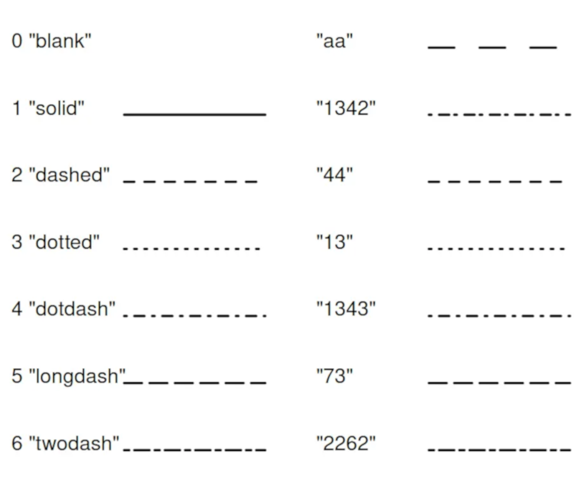{width="48%" fig-alt="Types de lignes."}
:::

:::{.column width="10%"}
<!-- colonne vide pour espacer les 2 colonnes de texte -->
:::

:::{.column width="45%"}
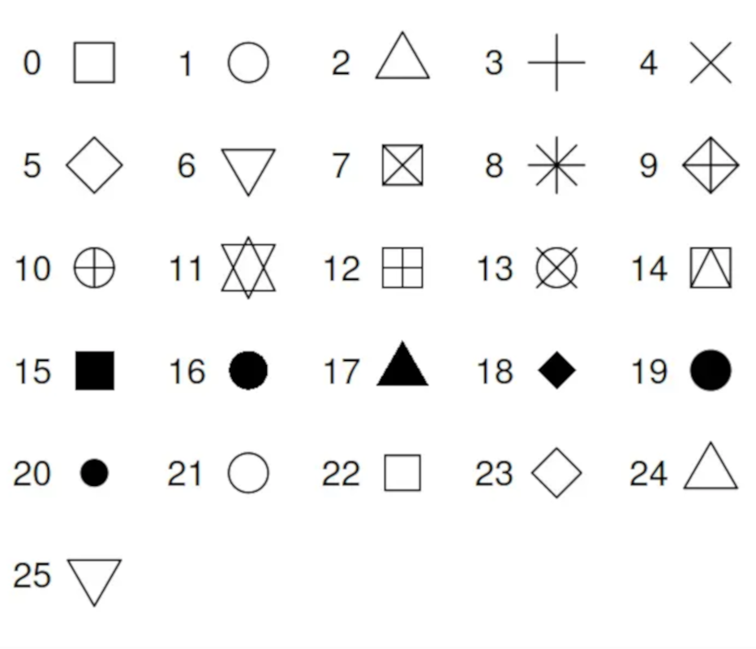{width="48%" fig-alt="Symboles de points."}

![Les couleurs (package [[{RColorBrewer}]{.pkg})](https://cran.r-project.org/web/packages/RColorBrewer/RColorBrewer.pdf){target="_blank"}](img/Rplotbrewer.png){width="80%" fig-alt="Package RColorBrewer."}
:::

::::

---

:::{.callout-tip title="Aide pour le choix des couleurs"}
- **Packages**  
  `r fontawesome::fa("r-project", prefer_type = "solid", fill = "#A626A4")`  [[{paletteer}]{.pkg}](https://github.com/EmilHvitfeldt/paletteer){target="_blank"} : recense des milliers de palettes (2893) issues de packages différents (79)  
  `r fontawesome::fa("r-project", prefer_type = "solid", fill = "#A626A4")`  [[{cols4all}]{.pkg}](https://github.com/mtennekes/cols4all){target="_blank"} : une application Shiny pour explorer les palettes, accessibles pour tous, y compris les personnes souffrant d'un déficit de vision des couleurs

  ```r
  cols4all::c4a_gui()
  ```

- **Sites**  
  `r fontawesome::fa("globe", fill = "#A626A4")` Informations sur une couleur : <https://chir.ag/projects/name-that-color/>{target="_blank"}  
  `r fontawesome::fa("globe", fill = "#A626A4")` Un générateur de palettes de couleurs : <https://coolors.co/>{target="_blank"}  
  `r fontawesome::fa("globe", fill = "#A626A4")` Des palettes de couleurs prédéfinies : <https://flatuicolors.com/>{target="_blank"}  
  `r fontawesome::fa("globe", fill = "#A626A4")` Des palettes de couleurs pour la cartographie : <http://colorbrewer2.org>{target="_blank"}
:::

###    Exemples de graphiques de base avec [[{ggplot2}]{.pkg}](https://ggplot2.tidyverse.org/){target="_blank"}

####   Histogramme

```{r}
#| label: geomhistogram
#| fig-align: center
#| fig-height: 4.5

# Histogramme du nombre total de citations ("citestot")
ggplot(data = Journals) +
  aes(x = citestot) +
  geom_histogram(bins = 10,  # nb de barres (30 par défaut)
                 fill = "skyblue",  # remplissage des barres
                 color = "black") + # couleur de la bordure
  # Ajout du titre et des labels
  labs(title = "Histogramme du nombre total de citations",
       x = "citestot",
       y = "Effectif")
```

---

####   Boxplot

```{r}
#| label: geomboxplot
#| fig-align: center
#| fig-height: 4.5

# Boxplot du nombre total de citations ("citestot")
# selon l'appartenance à une société ("society")
ggplot(data = Journals) +
  aes(x = society, y = citestot) +
  geom_boxplot(fill = "purple") +   # couleur des boîtes
  # Ajout du titre et des labels
  labs(title = "Boxplot du nombre de citations
                selon l'appartenance à une société",
       x = "society",
       y = "citestot")
```

---

####   Diagramme en barres

```{r}
#| label: geombar
#| fig-align: center
#| fig-height: 4.5

# Barplot du nombre de revues
# selon l'appartenance à une société ("society")
ggplot(data = Journals) +
  aes(x = society) +
  geom_bar(fill = "#00a3a6") +   # couleur des barres
# Ajout du titre et des labels
  labs(title = "Barplot du nombre de revues 
                selon l'appartenance à une société",
       x = "society",
       y = "Nombre")
```

###    Exemple de mise en forme plus avancée d'un graphique avec [[{ggplot2}]{.pkg}](https://ggplot2.tidyverse.org/){target="_blank"}

<div class=small-code>

```{r}
#| label: exggplot
#| fig-height: 4
#| fig-align: center

ggplot(data = Journals) +    # initialisation du graphique
  aes(x = oclc,              # variable en abscisse
      y = libprice,          # variable en ordonnée
      colour = society) +    # points colorés selon les valeurs de "society"
  geom_point(shape = 1,      # type de symbole
             size = 1.5,     # taille des symboles
             stroke = 1.5) + # épaisseur de la bordure des symboles
  scale_x_continuous(limits = c(0, 1000)) + # limites de l'axe des x
  scale_y_continuous(limits = c(0, 2500),   # limites de l'axe des y
                     breaks = seq(from = 0, to = 2500, by = 500)) +  # graduations de l'axe des y
  labs(title = "Exemple de création d'un graphique {ggplot2}",  # titre du graphique
       subtitle = "Nuage de points du prix de l'abonnement 
                   selon le nombre d'abonnements",  # sous-titre
       x = "Nombre d'abonnements",  # titre pour l'axe des x
       y = "Prix de l'abonnement",  # titre pour l'axe des y
       caption = "Les points sont colorés selon l'appartenance à une société") # légende
```

</div>

###    Sauvegarde des graphiques créés avec [[{ggplot2}]{.pkg}](https://ggplot2.tidyverse.org/){target="_blank"}

- Utilisation de la fonction `ggsave()` du package [[{ggplot2}]{.pkg}](https://ggplot2.tidyverse.org/){target="_blank"} à la fin de la création du graphique pour l'enregistrer

```r
# Sauvegarde du graphique
ggplot(...) +
  ...
ggsave(filename = name.extension,
       device = NULL)
```

<br>

:::::{.callout-tip title="Les formats d'enregistrement possibles"}

::::{.columns}
:::{.column width="47%"}
- png
- jpeg
- tiff
- bmp
- svg
:::

:::{.column width="6%"}
<!-- colonne vide pour espacer les 2 colonnes de texte -->
:::

:::{.column width="47%"}
- eps
- ps
- pdf
- tex
:::
::::

:::::

<br>

:::{.callout-note appearance="simple"}
- Le format du graphique peut être précisé dans le paramètre `device`  
Si `device = NULL`, le type de graphique est déterminé automatiquement en fonction de l'extension du nom du fichier
- La taille (`width` et `height`), ainsi que la résolution (`dpi`) peuvent être paramétrées
:::


###    Vous n'êtes pas à l'aise pour réaliser un graphique [[{ggplot2}]{.pkg}](https://ggplot2.tidyverse.org/){target="_blank"} ?

Une interface "clic bouton", avec la possibilité de récupérer les lignes de code, peut vous aider
`r fontawesome::fa("r-project", prefer_type = "solid", fill = "#A626A4")`  [[{esquisse}]{.pkg}](https://github.com/dreamRs/esquisse){target="_blank"}

- Commande pour lancer [[{esquisse}]{.pkg}](https://github.com/dreamRs/esquisse){target="_blank"}
```r
esquisse::esquisser()
```

::::{.columns}
:::{.column width="47%"}
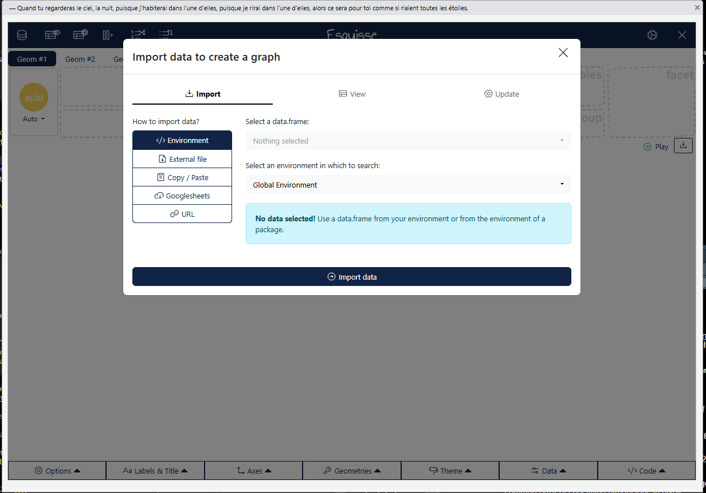{fig-align="center" fig-alt="Esquisse - import data."}
:::

:::{.column width="6%"}
<!-- colonne vide pour espacer les 2 colonnes de texte -->
:::

:::{.column width="47%"}
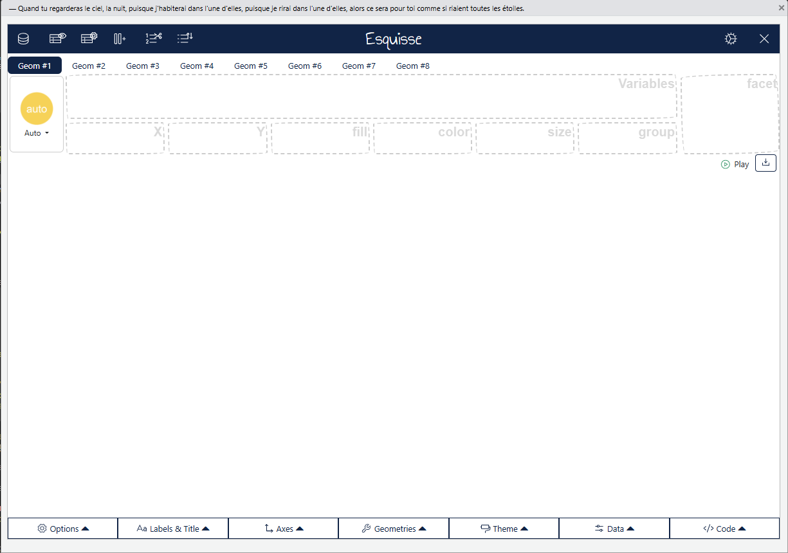{fig-align="center" fig-alt="Esquisse - menus."}
:::
::::

###    Un site pour aider à trouver la représentation la plus appropriée aux données

:::{.content-visible unless-format="pdf"}
```{=html}
<p align="center"><iframe scrolling= "yes" width = "1000" height = "800" allowfullscreen="TRUE" src="https://www.data-to-viz.com/"></iframe></p>
<p align="right"><small>Site : <a href=https://www.data-to-viz.com/>from Data to Viz</a></small></p>
```
:::

:::{.content-visible when-format="pdf"}
***Voir le site [from Data to Viz](https://www.data-to-viz.com/){target="_blank"}***
:::


<!-- EXERCICE 2. -->
##     `r fontawesome::fa("keyboard")` À VOUS DE JOUER ! {background-color="#222251" .purplewhite-text}
:::{#exr-seance2}
**Construire des graphiques avec `{ggplot2}` à partir du jeu de données `communes`**

Compléter le script **`01_Exercices_VisuR.R`** du projet **VisuR_exercices** pour créer les graphiques suivants :

1. un diagramme en barres pour visualiser la distribution de la variable 'region'  
*Pour ce graphique on choisit de colorer les barres en bleu*
2. un histogramme pour visualiser la distribution de la variable de surface_urbaine pour l'année 2020  
*Choisir un nombre ou une largeur de classes pertinents pour pouvoir interpréter le graphique*  
3. un boxplot du taux de chômage selon l'année  
*Pour ce graphique, on choisit de colorer les boîtes en fonction de l'année*
4. Sauvegarder ce graphique dans le dossier adéquat, en `png`

`r fontawesome::fa("circle-exclamation", fill = "#FFFFFF")` **Les graphiques doivent comporter toutes les informations utiles (étiquettes) pour faciliter leur compréhension**
:::


##     {background-color="#222251" .unlisted .unnumbered .purple-text}

:::{#sol-seance2}
**Script 01_Exercices_VisuR.R**
```{r}
#| label: exr2
#| eval: false
#| code-fold: true

#   ____________________________________________________________________________
#   Exercice sur les graphiques ggplot2                                     ####

# 01. Diagramme en barres - variable 'region'
ggplot(data = communes) +      # initialisation du graphique
  aes(x = region) +            # variable à représenter
  geom_bar(fill = "blue") +    # type de graphique = barplot ; couleur des barres
  # Ajout du titre, des étiquettes des axes et de la source des données
  labs(title = "Distribution de la variable 'region'",
       x = "Région",
       y = "Effectifs",
       caption = "Source : données fictives 'communes'")

# Le graphique n'est pas très lisible
# On peut tracer le graphique avec des barres horizontales, en remplaçant x par y dans aes() :
ggplot(data = communes) +      
  aes(y = region) +            
  geom_bar(fill = "blue")

# 02. Histogramme - variable 'surface_urbaine'
# a. On regarde la distribution de la variable
communes |> 
  select(surface_urbaine) |> 
  summary()
# b. On trace l'histogramme, avec des classes d'amplitude 1000
ggplot(data = communes |> 
                filter(annee == 2020)) +   # initialisation du graphique
  aes(x = surface_urbaine) +               # variable à représenter
  geom_histogram(binwidth = 1000) +        # type de graphique = histo ; amplitude des classes
  # Ajout du titre, des étiquettes des axes et de la source des données
  labs(title = "Distribution de la variable 'surface_urbaine'",
       x = "Superficie (ha)",
       y = "Effectifs",
       caption = "Source : données fictives 'communes'")

# 03. Boxplot - variable 'taux_chomage' x 'annee'
ggplot(data = communes |>                     # initialisation du graphique
         mutate(annee = as.factor(annee))) +  # transformation de 'annee' en facteur, pour avoir une boîte par modalité
  aes(x = annee,                              # variable en abscisse
      y = taux_chomage,                       # variable en ordonnée
      fill = annee) +                         # variable pour assigner une couleur aux boîtes 
  geom_boxplot() +                            # type de graphique = boxplot
  # Ajout du titre, des étiquettes des axes et de la source des données
  labs(title = "Distribution du taux de chômage selon l'année",
       x = "Année",
       y = "Taux de chômage (%)",
       caption = "Source : données fictives 'communes'")
# 04. Sauvegarde du graphique
ggsave("plots/boxplot_CHOMAGExAN.png")  # dossier / nom du graphique.extension
```
:::

#      Séance 3 - Visualisations avancées et approfondissement {ggplot2} {.theme-seance}

##     Préparation des données pour les graphiques {.theme-section1}

###    Résumer et grouper les données avec le package [[{dplyr}]{.pkg}](https://dplyr.tidyverse.org/){target="_blank"}

####   `summarise()` : créer un tableau contenant des statistiques agrégées (moyenne, somme, minimum, maximum, etc.), pour une ou plusieurs variables 

:::{.columns}
:::{.column width="47%"}
- Une variable et un indicateur

<div class="small-code">
```{r}
#| label: summarise1var

# Valeur la plus faible de 'libprice'
Journals |> 
  summarise(min(libprice))
```

- Plusieurs variables et un indicateur
```{r}
#| label: summariseContains

# Valeur médiane de chaque variable numérique 
# dont le nom contient le caractère "p"
Journals |> 
  select(where(is.numeric)) |> 
  summarise(across(contains("p"), median))
```

```{r}
#| label: summariseWhere

# Moyenne de chaque variable numérique du jeu de données `Journals`
Journals |> 
  summarise(across(where(is.numeric), 
                   ~ mean(.x, na.rm = TRUE)))
```

</div>
:::

:::{.column width="6%"}
<!-- colonne vide pour espacer les 2 colonnes de texte -->
:::

:::{.column width="47%"}

<div class="small-code">

- Une variable et plusieurs indicateurs
```{r}
#| label: summarise1varMult

# Calcul de plusieurs indicateurs pour 'libprice'
Journals |> 
  summarise(moyenne = mean(libprice, na.rm = TRUE), 
            ecartType = sd(libprice),
            mediane = median(libprice, na.rm = TRUE))
```

- Plusieurs variables et plusieurs indicateurs
```{r}
#| label: summariseAcross

# Calcul de plusieurs indicateurs pour 'libprice' et 'oclc' 
Journals |>
  summarise(across(c(libprice, oclc),
                   list(moyenne = mean,
                        ecartType = sd)))
```

</div>

:::{.callout-note appearance="simple"}
Avec `summarise(across())`, les noms des nouvelles variables sont créés en concaténant les noms des variables initiales et les noms des fonctions indiqués dans `list()`, séparés par un `_`
:::
:::
::::

---

::: {.callout-tip title="Exemples de fonctions couramment utilisées dans la fonction `summarise()`"}
- `n()` : nombre de lignes
- `min(x, na.rm = TRUE)` : minimum
- `max(x, na.rm = TRUE)` : maximum
- `sum()` : somme
- `mean(x, na.rm = TRUE)` : moyenne
- `sd(x, na.rm = TRUE)` : écart-type
- `median(x, na.rm = TRUE)` : médiane
- `quantile(x, na.rm = TRUE)` : quantiles
- `IQR(x, na.rm = TRUE)` : intervalle interquartiles
- `n_distinct()` : nombre de valeurs distinctes
:::

---

####   `group_by()` : définir des groupes à partir des modalités d'une variable catégorielle du jeu de données

::::{.columns}
:::{.column width="47%"}
`r fontawesome::fa("angles-right", fill = "#A626A4")` Une fois les groupes définis, on peut appliquer des opérations sur ces groupes (`mutate()`, `filter()`, `summarise()`, etc.)

<div class="small-code">
```{r}
#| label: groupby

# Comparaison des citations selon 'society'
Journals |>
  # Groupes selon les modalités de 'society' (no/yes)
  group_by(society) |>
  # Calcul de la moyenne par groupe
  # --> réduit chaque groupe à une ligne (= moyenne)
  summarise(citestot.mean = mean(citestot, 
                                 na.rm = TRUE))
```

</div>
:::

:::{.column width="6%"}
<!-- colonne vide pour espacer les 2 colonnes de texte -->
:::

:::{.column width="47%"}
`r fontawesome::fa("angles-right", fill = "#A626A4")` Très utile pour des graphiques par groupes

<div class="small-code">
```{r}
#| label: groupbyplot
#| fig-height: 4
#| fig-align: center

# Calcul de l'indicateur par groupe 
Journals |>
  group_by(society) |>
  summarise(citestot.mean = mean(citestot, 
                                 na.rm = TRUE)) |> 
# Graphique
  ggplot() + 
  aes(x = society, y = citestot.mean) + 
  geom_col(fill = "lightblue")
```

</div>
:::
::::

---

:::{.callout-tip appearance="simple"}
- On peut grouper selon plusieurs variables
```{r}
#| label: groupbymult
#| 
# Calcul de la moyenne de 'citestot'
# en fonction des variables 
# - 'society'
# - 'field' (uniquement les modalités Econometrics et Finance)
Journals |> 
  # Sélection des 2 domaines
  filter(field %in% c("Econometrics", "Finance")) |> 
  # Groupes
  group_by(society, field) |> 
  # Moyenne pour chacun des 4 groupes (2 x 2)
  summarise(citestot.mean = mean(citestot, na.rm = TRUE)) 
```

<br />

- Pour annuler la structuration en groupes, on utilise la fonction `ungroup()`
:::

###   Manipulations avec le package [[{tidyr}]{.pkg}](https://tidyr.tidyverse.org/){target="_blank"}


####   Le concept de données `tidy`

::::{.columns}
:::{.column width="47%"}
- **Un jeu de données `tidy` ("rangé")  est un jeu de données où**  
  + chaque variable est dans une colonne  
  + chaque observation est dans une ligne  
  + chaque valeur est dans une cellule
  
:::

:::{.column width="6%"}
<!-- colonne vide pour espacer les 2 colonnes de texte -->
:::

:::{.column width="47%"}
{fig-align="center" fig-alt="Données tidy."}
<center><small>Source : @Wickham2018</small></center>
:::
::::

:::::{.columns}
::::{.column width="47%"}
- Les jeux de données ne respectent pas toujours ces règles  
  + en-têtes de colonnes ne sont pas des noms mais des valeurs  
  + plusieurs variables stockées dans une colonne  
  + variables stockées dans les lignes et les colonnes  
  + plusieurs types d'observations stockés dans le même tableau, etc.
  
::::

::::{.column width="6%"}
<!-- colonne vide pour espacer les 2 colonnes de texte -->
::::

::::{.column width="47%"}
`r fontawesome::fa("angles-right", fill = "#A626A4")` **On peut ranger les données avec les verbes de [[{tidyr}]{.pkg}](https://tidyr.tidyverse.org/){target="_blank"}**  
- `pivot_longer()` : du format large au format long  
- `pivot_wider()` : du format long au format large

<br />

::: {.callout-tip appearance="simple"}
Les fonctions du package [[{tidyr}]{.pkg}](https://tidyr.tidyverse.org/){target="_blank"} sont disponibles dans la [_cheatsheet_](https://rstudio.github.io/cheatsheets/html/tidyr.html){target="_blank"} du package
:::
::::
:::::

---

:::{.callout-note title="Format large, format long : quelle différence ?"}
- **Format large** : une variable = une colonne  

| pays   | 2019       | 2020       | 2021       |  
|:-------|:-----------|:-----------|:-----------|
| France | 67 144 101 | 67 287 241 | 67 407 241 | 
: Format large (données de population)

<br />

- **Format long** : une ligne = une observation d'une variable

| pays   | année | valeur     |
|:-------|:------|:-----------|
| France | 2019  | 67 144 101 |
| France | 2020  | 67 287 241 |
| France | 2021  | 67 407 241 |
: Format long

:::

---

####   `pivot_longer()` : passer du format large à long

Fonction qui convertit plusieurs colonnes en deux nouvelles colonnes : une pour les noms des variables ; une pour leurs valeurs correspondantes

`r fontawesome::fa("angles-right", fill = "#A626A4")` **Réduit le nombre de colonnes mais augmente celui des lignes**, rendant ainsi le jeu de données plus "long"

<div class="small-code">
```{r output.lines=9}
#| label: pivotlonger

Journals_long <- Journals |>
  mutate(ID = seq(1:nrow(Journals))) |> # ajout d'une variable ID (1 n° = 1 journal)
  select(ID, title, libprice, pages, charpp) |> # sélection des variables pour une meilleure lisibilité de cet exemple
  pivot_longer(cols = c(libprice, pages, charpp), # colonnes à pivoter
               names_to = "variable", # nom de la colonne du format long qui contiendra les anciens noms de colonnes du format large
               values_to = "valeur")  # nom de la colonne du format long qui contiendra les anciennes valeurs du format large

Journals_long
```

</div>
<br />

`r fontawesome::fa("lightbulb", fill = "#A626A4")` **Particulièrement utile pour restructurer les données pour les analyses statistiques ou représentations graphiques qui nécessitent un format long**

---

#####  Exemple d'utilisation dans un graphique

```{r}
#| label: pivotwiderplot
#| fig-align: center
#| fig-height: 6

ggplot(data = Journals_long) +
  aes(x = variable, y = valeur, fill = variable) +
  geom_boxplot() +
  labs(title = "Distribution des variables",
       x = "Variable",
       y = "Valeur")
```

---

####   `pivot_wider()` : passer du format long à large

Fonction qui transforme les données du format long au format large (_wide_)

<div class="small-code">
```{r}
#| label: pivotwider

Journals_long |>
  pivot_wider(names_from = variable, # colonne du format long dont les valeurs deviendront des noms de colonnes du format large
              values_from = valeur) # colonne du format long dont les valeurs rempliront les cellules du format large
```

</div>
<br />

##     Personnalisation des graphiques {.theme-section1}

###    La couche *coord* du package [[{ggplot2}]{.pkg}](https://ggplot2.tidyverse.org/){target="_blank"}

:::: {.columns}
::: {.column width="45%"}
- Permet de choisir le système de coordonnées dans lequel sont projetées les données
- Par défaut, il s'agit du système cartésien, mais on trouve d'autres systèmes :

  + `coord_equal()` : pour avoir la même échelle pour l'axe des abscisses et des ordonnées  (cartésiens)
  + `coord_flip()`: pour inverser l'axe des abscisses et des ordonnées
  + `coord_cartesian()` : pour fixer des limites
  + `coord_radial()` : pour les graphiques circulaires
  + `coord_map()` : pour différentes projections cartographiques

:::

::: {.column width="10%"}
<!-- colonne vide pour espacer les 2 colonnes de texte -->
:::

::: {.column width="45%"}
**Exemple d'utilisation de `coord_flip()`**

```{r}
#| label: coord
#| eval: true
#| include: true
#| message: false
#| warning: false
#| echo: true
#| fig-align: center

# Inversion abscisses / ordonnées
# pour faciliter la lecture
ggplot(data = Journals) +
  aes(x = field) +
  geom_bar() +
  coord_flip()
```

:::
::::

###    La couche _facets_ du package [[{ggplot2}]{.pkg}](https://ggplot2.tidyverse.org/){target="_blank"}

- **Le _faceting_ permet de comparer graphiquement plusieurs sous-groupes sans surcharger un graphique**

- Le principe consiste à diviser la fenêtre graphique en plusieurs "panneaux" (_facets_), qui correspondent chacun à un groupe

- **Avantages**
  + comparaison visuelle facilitée : mêmes axes, mêmes échelles, légende cohérente entre les _facets_
  + meilleure lisibilité quand il y a beaucoup de groupes
  
- Deux fonctions principales : `facet_wrap()` et `facet_grid()`

---

####   `facet_wrap()` : une variable, plusieurs _facets_

**Crée un graphique pour chaque modalité d'une variable catégorielle, en les disposant _les uns à côté des autres_ avec une répartition automatique dans la fenêtre graphique**

`r fontawesome::fa("circle-info", fill = "#A626A4")` On peut contrôler la disposition des _facets_ avec `ncol` (nombre de colonnes), `nrow` (nombre de lignes) ou encore `dir` ("`h`" pour une présentation horizontale, "`v`" pour une présentation "verticale")

```{r}
#| label: facetwrap
#| fig-align: center
#| fig-height: 4

# Nuages de points du prix de l'abonnement selon le nombre d'abonnements
# en fonction des modalités 'society'
ggplot(data = Journals) +
  aes(x = oclc,
      y = libprice) +
  geom_point() +
  facet_wrap(vars(society))  # variable de groupe
```

---

####   `facet_grid()` : deux variables, une grille

**Crée un graphique en _facettant_ par deux variables : une pour les lignes, une pour les colonnes**

`r fontawesome::fa("circle-info", fill = "#A626A4")` Chaque combinaison de modalités a un _facet_, même s'il ne contient pas de données

```{r}
#| label: facetgrid2var
#| fig-align: center
#| fig-height: 4

# Nuages de points du prix de l'abonnement selon le nombre d'abonnements
# en fonction des modalités 'society' et 'field' (croisées)
Journals |> 
    filter(field == "Demography" | field == "Finance" | 
             field == "Econometrics") |> # sélection de modalités pour une meilleure lisibilité de cet exemple
    ggplot() +
    aes(x = oclc,
        y = libprice) +
    geom_point() +
    facet_grid(society ~ field) # lignes ~ colonnes
```

---

:::{.callout-tip appearance="minimal"}
Dans `facet_grid()`, on peut également désigner précisément la variable à mettre en ligne avec `rows` et celle à mettre en colonne avec `cols`, avec la fonction `vars()`

`r fontawesome::fa("angles-right", fill = "#A626A4")` Les commandes suivantes produisent donc le même graphique que précédemment

```{r}
#| label: facetgridvars
#| fig-align: center
#| fig-height: 3
#| output-location: column

Journals |> 
    filter(field == "Demography" | field == "Finance" | 
             field == "Econometrics") |> # sélection de modalité pour une meilleure lisibilité de cet exemple
    ggplot() +
    aes(x = oclc,
        y = libprice) +
    geom_point() +
    facet_grid(rows = vars(society), # variable des lignes
               cols = vars(field))   # variable des colonnes
```

`r fontawesome::fa("circle-info", fill = "#A626A4")` Si on ne met qu'une seule variable dans `facet_grid()`, le graphique est équivalent à celui produit par `facet_wrap()`


```{r}
#| label: facetgrid1var
#| fig-align: center
#| fig-height: 3
#| output-location: column
Journals |> 
    filter(field == "Demography" | field == "Finance" | 
               field == "Econometrics") |> # sélection de modalité pour une meilleure lisibilité de cet exemple
    ggplot() +
    aes(x = oclc,
        y = libprice) +
    geom_point() +
    facet_grid(cols = vars(society))
```

On peut utiliser `facet_grid(cols = vars(society))` si on souhaite une disposition en lignes
:::

###    La couche _theme_ du package [[{ggplot2}]{.pkg}](https://ggplot2.tidyverse.org/){target="_blank"}

**Elle permet de personnaliser l'apparence d'un graphique en modifiant les éléments visuels qui ne sont pas directement liés aux données**

- titres
- étiquettes
- polices
- arrière-plan
- grilles
- légendes
- tailles
- etc.

On utilise pour cela la fonction principale `theme()`  
On utilise des sous-fonctions de type `element_*()`, pour ajuster les éléments particuliers du graphique

---

####   Utiliser un thème prédéfini

:::: {.columns}
::: {.column width="47%"}
- **Les différents thèmes qui existent**

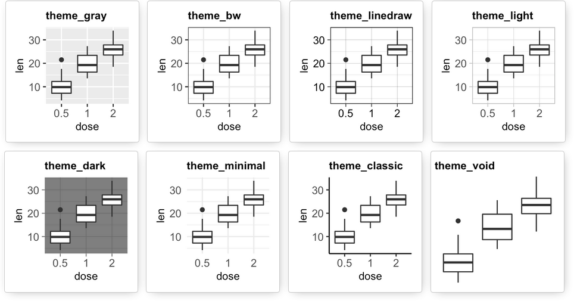{width="95%" fig-align="center" fig-alt="Thèmes ggplot."}
:::

::: {.column width="6%"}
<!-- colonne vide pour espacer les 2 colonnes de texte -->
:::

::: {.column width="47%"}
- **Exemple d'utilisation**

<div class="small-code">
```{r}
#| label: theme
#| fig-align: center
#| fig-height: 3

# Nuage de points avec le theme Dark
ggplot(data = Journals) +
  aes(x = oclc, y = libprice,
      colour = society) +
  geom_point() +
  theme_dark()
```

</div>

:::
::::

::: {.callout-tip appearance="simple"}
On peut définir le thème pour toute la durée de la session avec `theme_set()`

```{r}
#| label: themeset
#| eval: false

# Thème Dark pour tous les plots
theme_set(theme_dark())

ggplot() +
  ...
```

`r fontawesome::fa("angles-right", fill = "#A626A4")` Les graphiques seront tous réalisés avec le thème indiqué dans `theme_set()`
:::

---

####   Éditer un thème existant

Il est possible de modifier un thème existant, en utilisant la fonction `theme_update()` du package [[{ggplot2}]{.pkg}](https://ggplot2.tidyverse.org/){target="_blank"}

```{r}
#| label: themeupdate
# Personnalisation du thème
theme_update(panel.grid.major = element_line(color = "grey80"), # couleur de la grille principale
             panel.grid.minor = element_line(colour = "black",  # couleur de la grille secondaire
                                             linewidth = 1),    # épaisseur de la grille secondaire
             panel.background = element_rect(fill = "white"),   # couleur de fond
             text = element_text(family = "sans", size = 14),   # taille du texte
             plot.title = element_text(color = "#275662"        # couleur du titre
                                       , face = "bold"),        # police en gras
             axis.title.x = element_text(color = "purple"),     # couleur du label de l'axe des abscisses
             axis.title.y = element_text(size = 20,             # taille
                                         color = "blue"))       # et couleur du label de l'axe des ordonnées
```

```{r}
#| label: plotthemeupdate
#| fig-align: center
#| fig-height: 3
#| output-location: column

# Réalisation du graphique avec ces modifications
ggplot(data = Journals) +
    aes(x = oclc,
        y = libprice,
        colour = society) +
    geom_point() +
  ggtitle("Un test de modification du thème")

```

`r fontawesome::fa("triangle-exclamation", fill = "#A626A4")` **Theme_update() : change le thème global**  
`r fontawesome::fa("angles-right", fill = "#A626A4")` Tous les graphiques créés après utiliseront ces paramètres par défaut

---

####   Vous ne savez pas comment modifier les paramètres d'un thème ? 

L'interface "clic bouton" de `r fontawesome::fa("r-project", prefer_type = "solid", fill = "#A626A4")` [[{ggThemeAssist}]{.pkg}](https://github.com/calligross/ggthemeassist){target="_blank"} peut vous aider

::::{.columns}
:::{.column width="47%"}
`r fontawesome::fa("circle-question", fill = "#A626A4")` **Comment ça marche ?**  

1. Sélectionner le code du graphique  
2. Lancer la commande `ggThemeAssistGadget()` ou utiliser le menu _Addins_ et sélectionner `ggplot2 Theme Assistant`   
3. Modifier les paramètres (taille des titres, angle des étiquettes, position de la légende, couleurs de fond, etc.), à l'aide des rubriques dans les différents onglets  
4. Cliquer sur '_Done_' pour valider : le code `theme(...)` correspondant aux modifications est inséré automatiquement dans le script
:::

::: {.column width="6%"}
<!-- colonne vide pour espacer les 2 colonnes de texte -->
:::

::: {.column width="47%"}
```r
# Création du graphique
# en lui donnant un nom sans "_" (erreur sinon)
plotolclibprice <- ggplot(data = Journals) +
  aes(x = oclc,
      y = libprice,
      colour = society) +
  geom_point() 

# Modification du thème pour ce graphique
ggThemeAssistGadget(plotolclibprice)
```

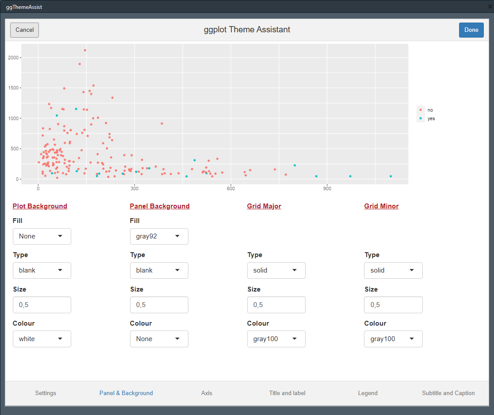{width="60%" fig-align="center" fig-alt="Interface de ggThemeAssist."}
:::
::::

---

####   Créer et utiliser son propre thème

Utile pour personnaliser l'apparence des graphiques, en ajustant divers éléments : titres, étiquettes, polices, arrière-plan, quadrillages et légendes

*_Exemple_*
```{r}
#| label: themecustom
#| output-location: column

# Création du thème
theme(axis.title.x = element_text(size = 20,
                                  face = "bold"),
      strip.background = element_rect(colour = "red",
                                      fill = "white"),
      legend.position = "bottom") -> themeperso

# Utilisation du thème
ggplot(data = Journals) +
  aes(x = oclc, y = libprice, colour = society) +
  geom_point()  +
  facet_wrap(vars(society)) +
  themeperso
```

::: {.callout-tip appearance="minimal"}
`r fontawesome::fa("globe", fill = "#A626A4")` Se reporter à la section [_theme_](https://ggplot2-book.org/themes){target="_blank"} de @ggplot22016 pour plus de détails
:::

<!-- EXERCICE 3. -->
##     `r fontawesome::fa("keyboard")` À VOUS DE JOUER ! {background-color="#222251" .purplewhite-text}
:::: {#exr-seance3}
Pour cet exercice, on se place toujours dans le projet **`VisuR_exercices`**. On explore avec {`ggplot2`}, les abonnements (prix et nombre) des revues dont l'initiale du domaine est "i"

01. Créer un nouveau script **[R]** pour cette analyse graphique
02. Sélectionner uniquement les données nécessaires pour l'exercice (variables et observations)
03. Étudier la distribution de chacune des variables liées à l'abonnement, par une _boxplot_ sur un même graphique, en utilisant les facettes
04. Transformer les variables numériques en variables catégorielles, en faisant des classes sur les quantiles
05. Construire un diagramme en barres pour ces deux nouvelles variables, selon le domaine  
+ 'libprice' : les barres doivent avoir une couleur différente selon catégorie de prix
+ 'oclc' : les barres seront de couleur verte

:::{.callout-note appearance="minimal"}
`r fontawesome::fa("triangle-exclamation", fill = "#FFFFFF")` Pour une bonne lisibilité, tous les graphiques devront être personnalisés avec  
a) un titre et des labels sur les axes  
b) un thème clair  
c) une palette de couleurs harmonieuse  
d) une taille des libellés augmentée
:::
::::

#      Bibliographie {.theme-seance}

<!-- Création de la base biblio des packages cités/utilisés dans le cours -->
```{r}
#| label: biblio
#| eval: false
#| include: false
#| echo: false
knitr::write_bib(c(# séance 1
                   "Ecdat", "readr", "tidyverse", "questionr", "strcode"
                   , "remotes", "styler", "lintr", "dplyr", "ggplot2"
                   , "forcats", "lubridate", "purrr", "stringr", "tibble"
                   , "tidyr", "magrittr", "readxl", "haven", "openxlsx2"
                   , "writexl", "xlsx", "foreign"
                   # séance 2
                   , "RColorBrewer", "paletteer", "cols4all", "esquisse"
                   # séances 3 & 4
                   )
                 , "packagesR_2026.bib")
```

###    Références citées {.unlisted .unnumbered .smaller}
<!-- https://github.com/pandoc-ext/multibib -->
:::{#refs-main}
<!-- Réfs citées dans le texte insérées dans cette section -->
:::


::::{.content-visible when-format="revealjs"}
###    Packages {.unlisted .unnumbered .smaller .scroll-container style="overflow-y: scroll;"}
:::{#refs-packages}
<!-- Réfs du fichier packagesR_2026.bib insérées dans cette section, sans être citées dans le texte -->

---
nocite: |
  @ggplot22016, @lintr2025, @lubridate2011, @R-dplyr, @R-Ecdat, @R-forcats, @R-foreign, @R-ggplot2, @R-haven, @R-lintr, @R-lubridate, @R-magrittr, @R-openxlsx2, @R-purrr, @R-questionr, @R-readr, @R-readxl, @R-remotes, @R-strcode, @R-stringr, @R-styler, @R-tibble, @R-tidyr, @R-tidyverse, @R-writexl, @R-xlsx, @tidyverse2019, @R-RColorBrewer, @R-paletteer, @cols4all2023, R-cols4all, @R-esquisse
---

:::
::::

::::{.content-visible unless-format="revealjs"}
###    Packages {.unlisted .unnumbered}
:::{#refs-packages}
<!-- Réfs du fichier packagesR_2026.bib insérées dans cette section, sans être citées dans le texte -->

---
nocite: |
  @ggplot22016, @lintr2025, @lubridate2011, @R-dplyr, @R-Ecdat, @R-forcats, @R-foreign, @R-ggplot2, @R-haven, @R-lintr, @R-lubridate, @R-magrittr, @R-openxlsx2, @R-purrr, @R-questionr, @R-readr, @R-readxl, @R-remotes, @R-strcode, @R-stringr, @R-styler, @R-tibble, @R-tidyr, @R-tidyverse, @R-writexl, @R-xlsx, @tidyverse2019, @R-RColorBrewer, @R-paletteer, @cols4all2023, R-cols4all, @R-esquisse
  
---

:::
::::

<!-- Pour compiler le document, dans le terminal lancer la commande : -->
<!-- quarto render index.qmd --to revealjs -->
